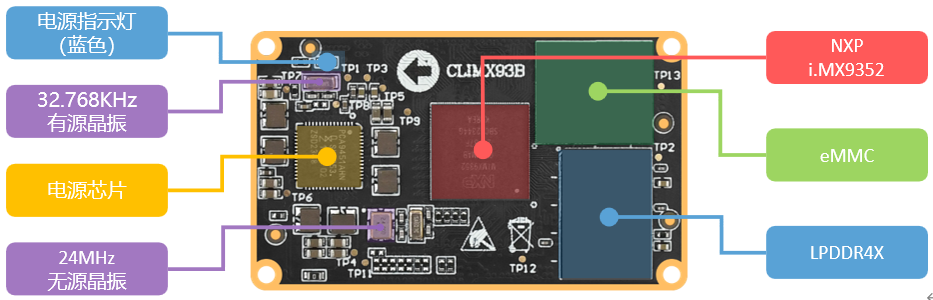

# 1.2 核心板资源简介

&emsp;&emsp;下面我们来看ATK-CLIMX93B核心板，如下图所示：

 
图 1.2.1 ATK-CLIMX93B核心板

&emsp;&emsp;整个核心板的外形尺寸为50mm*30mm大小，非常小巧，采用了0.4mm间距贴片板对板连接器，和底板BTB连接座的合高为1.5mm，可以很方便地应用在各种项目上。

&emsp;&emsp;正点原子ATK-CLIMX93B核心板板载资源如下： 
&emsp;&emsp;◆	CPU：MIMX9352CVVXMAB，双核Cortex-A55(主频1.7GHz)，单核Cortex-M33（250MHz），FCBGA306封装，11x11mm。 
&emsp;&emsp;◆	内存LPDDR4：容量为1GB。 
&emsp;&emsp;◆	存储EMMC：容量为16GB。 
&emsp;&emsp;◆	高稳定性电源管理PMIC。 
&emsp;&emsp;◆	两个2*50的BTB连接座公座，共计200PIN。 

&emsp;&emsp;正点原子ATK-CLIMX93B核心板的特点包括： 
&emsp;&emsp;1)、体积小巧。核心板仅50mm*30mm大小，方便使用到各种项目。 
&emsp;&emsp;2)、集成方便。核心板使用2个2*50P BTB连接座，可以非常方便地集成到客户PCB上，更换简单，方便维修测试。 
&emsp;&emsp;3)、资源丰富。核心板板载1GB LPDDR4内存、16GB EMMC存储器，可以满足多种应用需求。 
&emsp;&emsp;4)、性能稳定。核心板采用8层板设计，单独地层、电源层，且所有关键信号采用等长线走线，保证运行稳定、可靠。 
&emsp;&emsp;5)、人性化设计。按功能分区引出IO口，方便布线。

