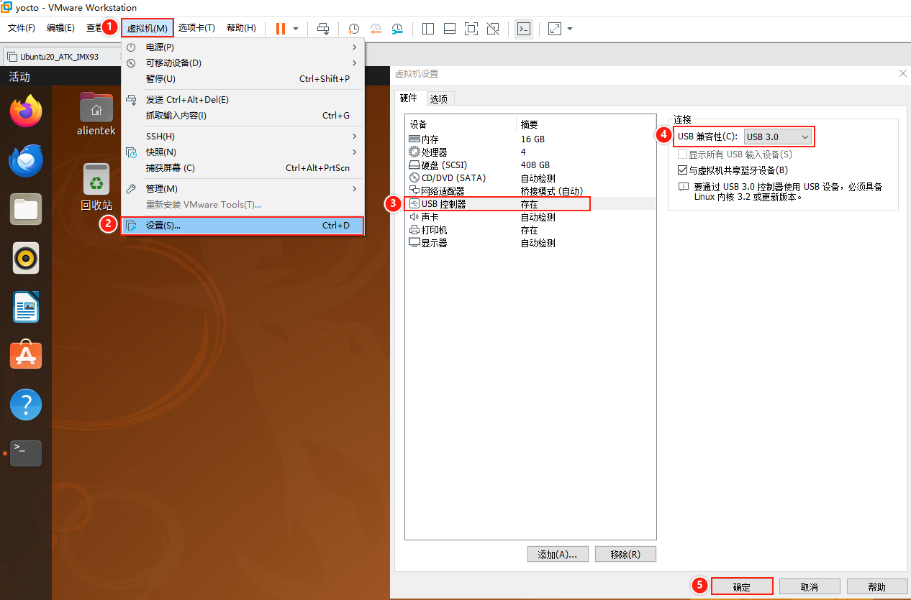
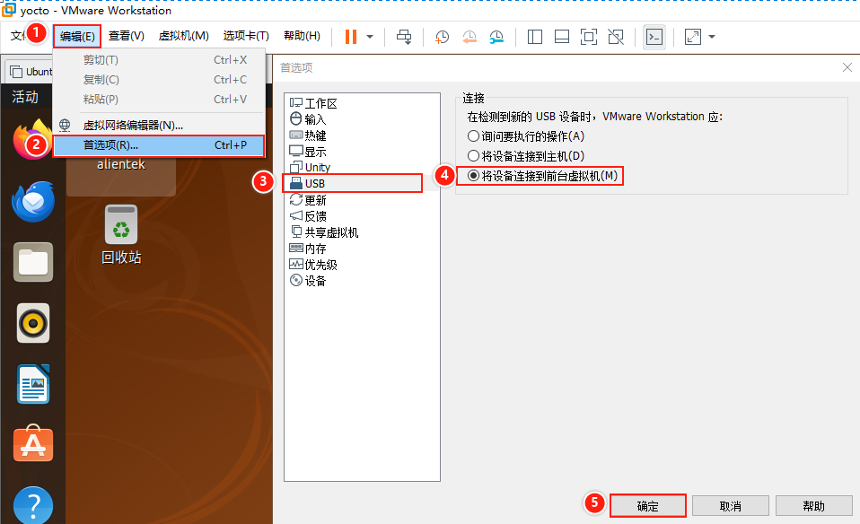
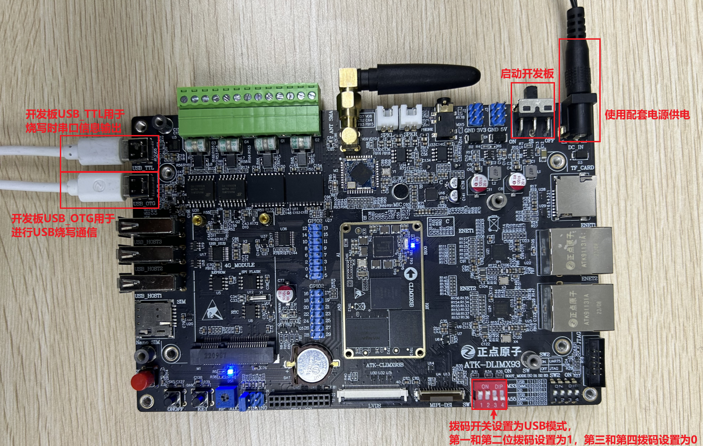

# 2.2 Ubuntu20.04下使用UUU烧写系统到开发板

## 2.2.1 开发板连接

&emsp;&emsp;将开发板拨码开关设置为USB烧写模式（**对应码位1100**）。

&emsp;&emsp;开发板USB_TTL接口通过Type-C线接到电脑USB端口，用于烧写时输出打印信息。如果开启了虚拟机，请将USB串口切换到Windows主机端。此项仅便于烧写错误时排查信息。

&emsp;&emsp;开发板**USB_OTG**接口通过Type-C线接到Ubuntu虚拟机的USB3.0端口，请将USB设备切换并固定到Ubuntu虚拟机端，用于烧写系统。

<center>
<br />
图 2.2.1 设置虚拟机USB接口兼容USB3.0
</center>

&emsp;&emsp;在烧写过程，开发板会重启，此时电脑可能会自动将USB连接到Windows中或者询问USB接入的设备，在这段时期内，UUU可能会提示烧写失败。因此建议在烧写前将虚拟机USB选项设置默认接到Ubuntu虚拟机中，这部分功能由VMware提供，如果一直烧写失败，可以尝试2.3小节的方法关闭虚拟机，在Windows下烧写。

<center>
<br />
图 2.2.2 设置USB默认连接到VMware
</center>

&emsp;&emsp;开发板连接状态如下图所示：

<center>
<br />
图 2.2.3 USB烧写时的开发板连接
</center>

## 2.2.2 环境准备

&emsp;&emsp;本小节中，笔者在Windows电脑上使用VMware虚拟机中的Ubuntu20.04系统进行UUU烧写，环境版本如下，仅供参考。

<div class="climx93b_center-table-div">
<table class="climx93b_center-table">
  <tr>
    <th>环境/软件/接口</th>
    <th>版本</th>
  </tr>
  <tr>
    <td>电脑架构</td>
    <td>X86</td>
  </tr>
  <tr>
    <td>电脑主机系统</td>
    <td>Windows10</td>
  </tr>
  <tr>
    <td>VMware软件</td>
    <td>15.5.0</td>
  </tr>
  <tr>
    <td>Linux发行版</td>
    <td>Ubuntu20.04</td>
  </tr>
  <tr>
    <td>USB接口</td>
    <td>USB3.0</td>
  </tr>
</table>
</div>

&emsp;&emsp;在Ubuntu20.04中需要安装的软件包：

```c#
sudo apt-get install libusb-1.0.0-dev libzip-dev libbz2-dev libtinyxml2-dev
```

## 2.2.3 烧写固件

&emsp;&emsp;**开发板固件包位于：开发板光盘A盘-基础资料\08、系统镜像**

&emsp;&emsp;将开发板固件包拷贝到Ubuntu中，并查看固件包目录，如下图所示：


<center>
<br />
图 2.2.4 固件包目录
</center>

&emsp;&emsp;我们将在Ubuntu20.04中使用uuu工具来进行开发板固件烧写，在终端执行下面指令进行固件烧写。可以将uuu程序拷贝到Ubuntu的/usr/bin目录，更方便使用。使用chmod指令修改烧写脚本alientek-imx93-emmc.uuu的权限后，运行烧写脚本。

```c#
sudo cp uuu /usr/bin
sudo chmod +x alientek-imx93-emmc.uuu
sudo uuu alientek-imx93-emmc.uuu
```

<center>
<br />
图 2.2.5 烧写固件
</center>

&emsp;&emsp;在烧写完fsl-image-mfgtool-initramfs-imx_mfgtools.cpio.zst.u-boot后，开发板会重启一次系统，此过程中注意要保持开发板USB是一直连接在虚拟机上的，否则烧写会报错打不开USB设备并中断，需要重新烧写系统，重新烧写前需要重启或复位一次开发板。

&emsp;&emsp;使用uuu程序运行alientek-imx93-emmc.uuu烧写脚本，将固件烧写到开发板的EMMC存储中。uuu烧写速度较快，最终烧写完成后命令终端如下图所示：


<center>
<br />
图 2.2.6 烧写成功
</center>


&emsp;&emsp;烧写完成后，将拨码开关设置为EMMC模式（码位0000），即可启动开发板进入系统。

