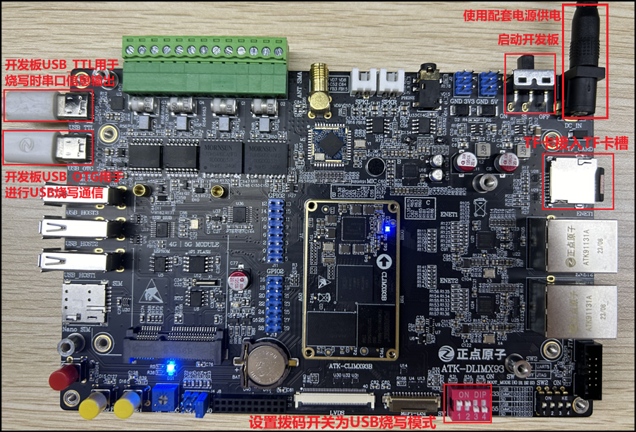
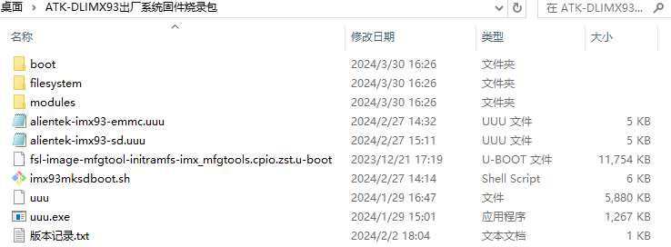
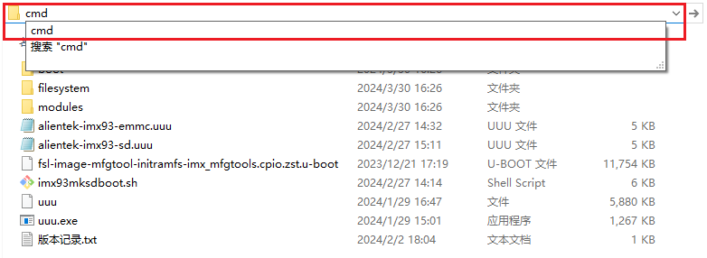
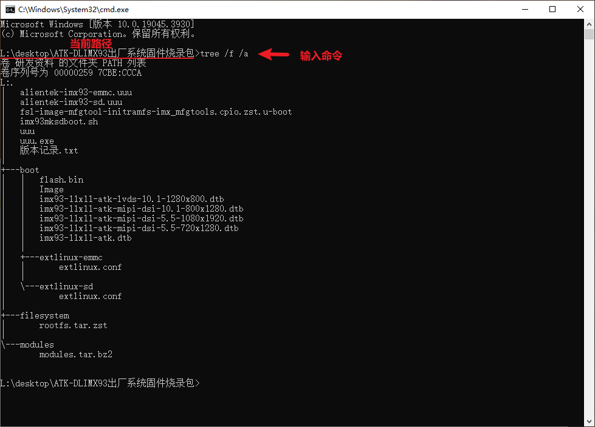
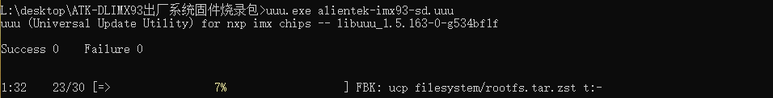
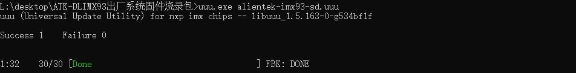

# 2.5 Window下使用UUU烧写系统到TF卡

## 2.5.1 开发板连接

&emsp;&emsp;准备一张**容量大于8GB的高速TF卡**并格式化为FAT32格式，将TF卡接入到开发板的TF卡槽中。 将开发板拨码开关设置为USB烧写模式（对应码位1100）。

&emsp;&emsp;开发板USB_TTL接口通过Type-C线接到电脑USB端口，用于烧写时输出打印信息。如果开启了虚拟机，请将USB串口切换到Windows主机端。此项仅便于烧写错误时排查信息。

&emsp;&emsp;开发板USB_OTG接口通过Type-C线接到Windows电脑自带的USB3.0端口，用于烧写系统。如果开启了虚拟机，请将USB设备切换固定到Windows主机端。

&emsp;&emsp;在烧写过程，开发板会重启，此时电脑可能会自动将USB连接到虚拟机中或者询问USB接入的设备，在这段时期内，UUU可能会提示烧写失败。因此建议在烧写前将虚拟机USB选项设置默认接到Windows主机中，或者烧写前关闭虚拟机。

&emsp;&emsp;开发板连接状态如下图所示：


<center>
<br />
图 2.5.1 USB烧写时的开发板连接
</center>

## 2.5.2 环境准备

&emsp;&emsp;本小节中，笔者在Windows电脑上进行UUU烧写，环境版本如下，仅供参考。

<div class="climx93b_center-table-div">
<table class="climx93b_center-table">
  <tr>
    <th>环境/软件/接口</th>
    <th>版本</th>
  </tr>
  <tr>
    <td>电脑架构</td>
    <td>X86</td>
  </tr>
  <tr>
    <td>电脑主机系统</td>
    <td>Windows10</td>
  </tr>
  <tr>
    <td>USB接口</td>
    <td>USB3.0</td>
  </tr>
</table>
</div>


## 2.5.3 烧写固件

&emsp;&emsp;**开发板固件包位于：开发板光盘A盘-基础资料\08、系统镜像**

&emsp;&emsp;将开发板固件包拷贝到Windows主机中，并打开固件包目录，如下图所示：


<center>
<br />
图 2.5.2 固件包目录
</center>

&emsp;&emsp;在文件资源管理器的地址栏中输入 “cmd” 并按下 Enter 键，将打开一个名为 “命令提示符” （Command Prompt）的终端窗口。

<center>
<br />
图 2.5.3 路径栏输入cmd
</center>

&emsp;&emsp;通过该窗口，用户可以执行命令行指令和操作系统功能。注意Windows和Linux终端的命令有所差异。在 Windows 终端中，使用**tree /f /a** 命令可以在当前目录下以树状结构显示文件和文件夹，并包括完整路径信息。

```c#
tree /f /a
```

&emsp;&emsp;/f ：参数表示在输出中包含文件名称。<br />
&emsp;&emsp;/a ：参数表示显示完整的路径信息。<br />

<center>
<br />
图 2.5.4 Windows终端
</center>


&emsp;&emsp;我们将在Windows系统中使用uuu.exe工具来进行开发板固件烧写，在Windows终端执行下面指令进行固件烧写。

```c#
uuu.exe alientek-imx93-sd.uuu
```

<center>
<br />
图 2.5.5 烧写系统固件
</center>

&emsp;&emsp;在烧写完fsl-image-mfgtool-initramfs-imx_mfgtools.cpio.zst.u-boot后，开发板会重启一次系统，此过程中注意要保持开发板USB是一直连接在Windows上的，否则烧写会报错打不开USB设备并中断，需要重新烧写系统，重新烧写前需要重启或复位一次开发板。可以关闭虚拟机后再进行烧写。

&emsp;&emsp;使用uuu程序运行alientek-imx93-sd.uuu烧写脚本，将固件烧写到开发板的TF卡中。uuu烧写速度较快，但烧写的速度和TF卡质量挂钩(相比EMMC，TF卡的写入速度会慢些)，最终烧写完成后命令终端如下图所示：

<center>
<br />
图 2.5.6 烧写完成
</center>

&emsp;&emsp;烧写完成后，将拨码开关设置为**SD启动模式（码位1000）**，即可启动开发板进入系统。


