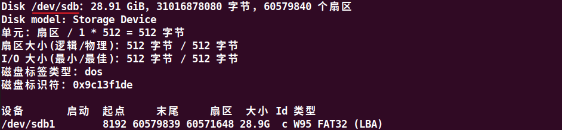

# 2.6 Ubuntu20.04下使用脚本制作TF系统启动卡

## 2.6.1 环境准备

&emsp;&emsp;**开发板固件包位于：开发板光盘A盘-基础资料\08、系统镜像**

&emsp;&emsp;将开发板固件包拷贝到Ubuntu中，并查看固件包目录，如下图所示：


<center>
<br />
图 2.6.1 固件包目录
</center>

&emsp;&emsp;使用chmod指令修改烧写TF卡系统脚本imx93mksdboot.sh的权限。

<center>
<br />
图 2.6.2 赋予脚本可执行权限
</center>

&emsp;&emsp;TF 卡用读卡器插到Ubuntu 虚拟机，如果Ubuntu 没提示连接可移动设备连接到虚拟机，按以下步骤连接到虚拟机，还有提前将虚拟机设置为USB3.0，将读卡器接到USB3.0接口。

<center>
<br />
图 2.6.3 连接TF 卡的步骤
</center>

&emsp;&emsp;输入如下指令查看TF卡挂载节点，如下图，笔者的TF卡容量是28.9GB(32GB)，可以看到挂载的节点为/dev/sdb。

```c#
sudo fdisk -l
```

<center>
<br />
图 2.6.4 查看TF卡在Ubuntu 上的连接节点
</center>

## 2.6.2 烧写固件

&emsp;&emsp;执行./imx93mksdboot.sh –help查看脚本的使用方法。

```c#
./imx93mksdboot.sh –help
```

<center>
<br />
图 2.6.5 查看imx93mksdboot.sh使用说明
</center>

&emsp;&emsp;用法说明：<br />

&emsp;&emsp;用法: imx93mksdboot.sh [选项] < (必选)- device >

&emsp;&emsp;（1）-device：指明设备节点（TF 卡挂载的节点如/dev/sdx），必需加这个参数

&emsp;&emsp;比如现在用户TF卡挂载节点为/dev/sdb。那么烧写TF卡的指令如下，执行指令后脚本会有中文再次询问TF卡所挂载的节点是否对应，将会清空TF卡上的所有数据，请注意备份重要的数据。按Enter 键确认后继续，固化TF卡需要大约需要几分钟时间，这里根据个人电脑不同和所用TF卡不同，可能花费的时间差异比较大。

&emsp;&emsp;执行烧写指令：

```c#
sudo ./imx93mksdboot.sh -device /dev/sdb
```

<center>
<br />
图 2.6.6 执行烧写系统到TF卡
</center>


&emsp;&emsp;在固化的过程中，会卸载TF 卡，在脚本执行时，鼠标不要离开Ubuntu 虚拟机，否则可能在脚本卸载TF 卡时，TF 卡连接到PC 主机上去了，这样脚本就无法找到TF 卡执行，就会提示“mount: special device /dev/sdb1 does not exist”这样的错误。固化时有中英文结合提示固化的过程，固化完成如下图。


<center>
<br />
图 2.6.7 烧写完成
</center>

&emsp;&emsp;按连接TF 卡到Ubuntu 的方法，再点击断开即可退出TF 卡。烧写完成后，将TF卡接入开发板TF卡槽（注意不是将读卡器接在开发板USB），将拨码开关拨至TF 启动方式1000，启动系统即可，可以提前接好串口看具体启动信息。

<center>
<br />
图 2.6.8 TF卡启动开发板
</center>


&emsp;&emsp;在串口终端可以看到具体的启动信息，对于ATK-DLIMX93开发板而言，/dev/mmcblk1对于的是TF卡，/dev/mmcblk1p1是boot分区，/dev/mmcblk1p2是rootfs分区。

<center>
<br />
图 2.6.9 TF卡启动信息
</center>


