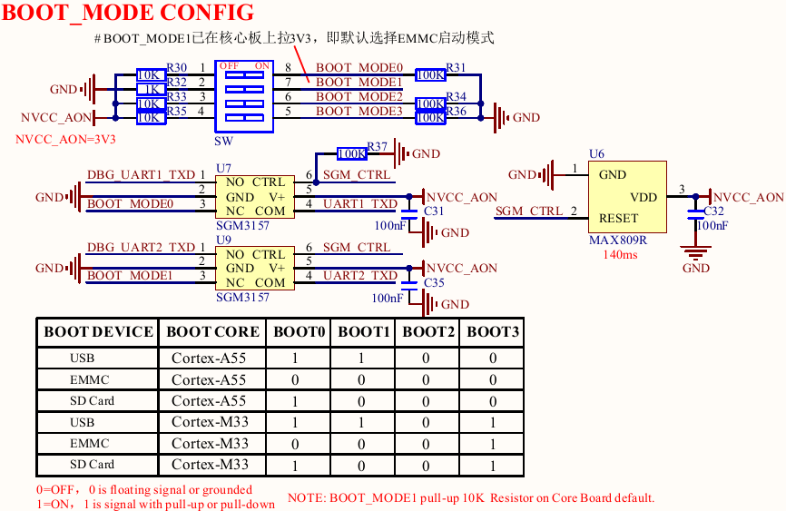
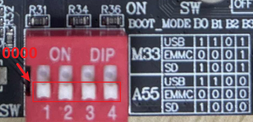
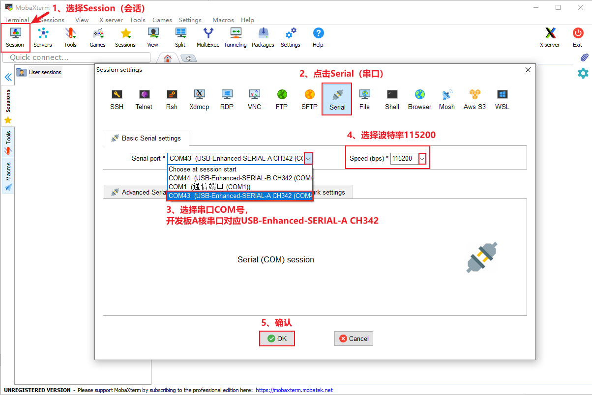
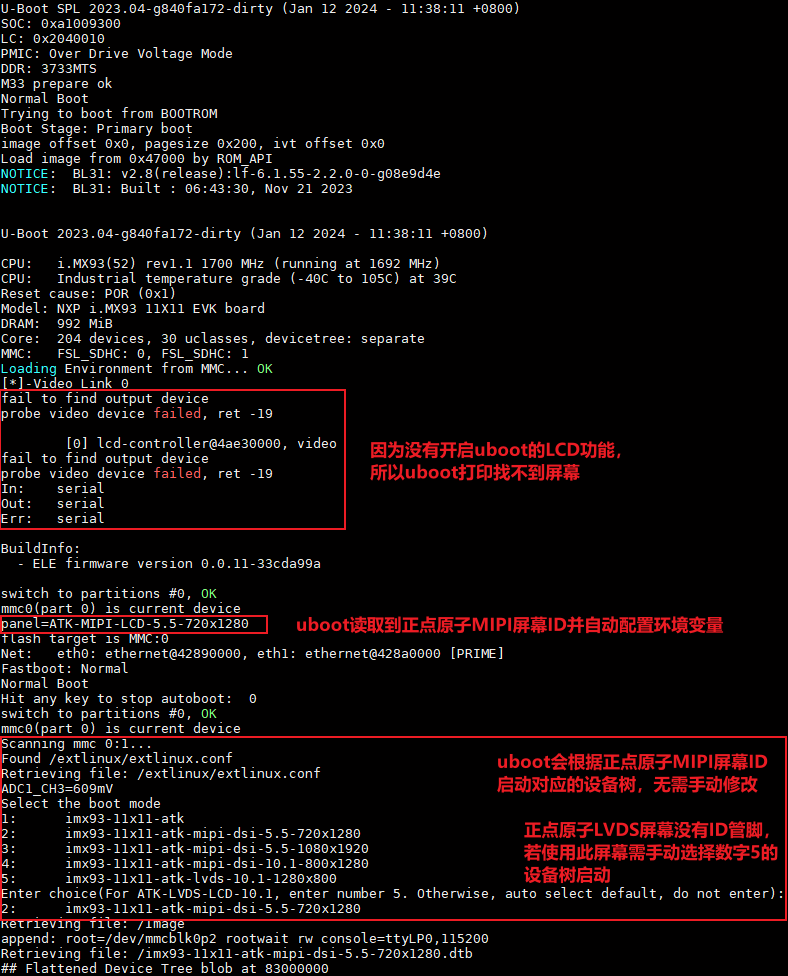
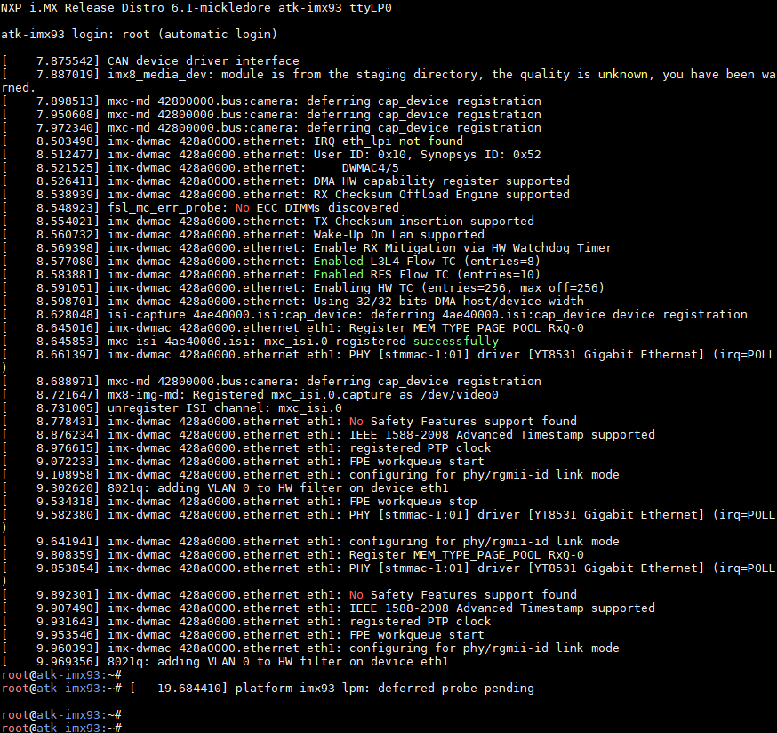

# 3.3 拨码开关设置及登陆开发板

&emsp;&emsp;ATK-DLIMX93开发板的拨码开关支持以下启动模式，下图是开发板底板BOOT原理图。

 
图 3.3.1 BOOT启动模式

&emsp;&emsp;由开发板原理图可知： 
&emsp;&emsp;（1）A核USB下载模式拨码为1100； 
&emsp;&emsp;（2）A核EMMC启动模式拨码为0000； 
&emsp;&emsp;（3）A核SD Card启动模式拨码为1000。 
&emsp;&emsp;（4）M核USB下载模式拨码为1100； 
&emsp;&emsp;（5）M核EMMC启动模式拨码为0001； 
&emsp;&emsp;（6）M核SD Card启动模式拨码为1001。 

&emsp;&emsp;ATK-DLIMX93开发板使用一根USB Type-C连接线，连接底板上的USB_TTL接口，另一端连接到PC(电脑)的USB接口，出厂时已经把Linux系统烧写到核心板上的eMMC存储上了。所以我们将拨码拨至0000，如下图，拨码向上表示为“1”（ON），向下表示为“0”(OFF)。

 
图 3.3.2 eMMC启动拨码方式

&emsp;&emsp;开发板插上DC12V直流电源，MobaXterm选择为串口类型，按如下设置。请选择相应的COM口（COM口是PC（电脑）识别开发板USB_TTL的串口号。**如果此时开着虚拟机，请注意串口是否在等待选择连接或者已连接到虚拟机上，需要将串口切换连接到Windows端**）。开发板使用CH342芯片将一路串口分为两路：

&emsp;&emsp;A核串口使用USB-Enhanced-SERIAL-**A**-CH342，

&emsp;&emsp;M核串口使用USB-Enhanced-SERIAL-**B**-CH342。

&emsp;&emsp;这里我们讲解使用基于A核启动的出厂系统，因此串口选择USB-Enhanced-SERIAL-A-CH342。

 
图 3.3.3 MobaXterm串口设置

&emsp;&emsp;开发板从eMMC模式启动后，串口终端打印U-Boot和内核的运行信息，我们可以启动开发板(开发板已启动的话可以重启开发板)，观察到串口打印如下。

 
图 3.3.4 串口打印的U-Boot运行信息

&emsp;&emsp;出厂文件系统由yocto构建而成，在启动完开发板后，Qt界面也会跟着启动。

&emsp;&emsp;默认不需要输入登录账户密码，直接进入到系统根目录。登录后串口终端如下图。

 
图 3.3.5 串口终端打印登录开发板的信息

&emsp;&emsp;注意：出厂文件系统默认支持SSH服务，当用户使用SSH登录时，需要输入账户为root，密码root。

