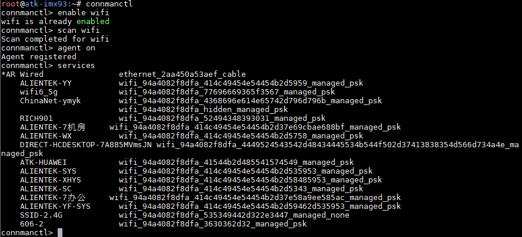
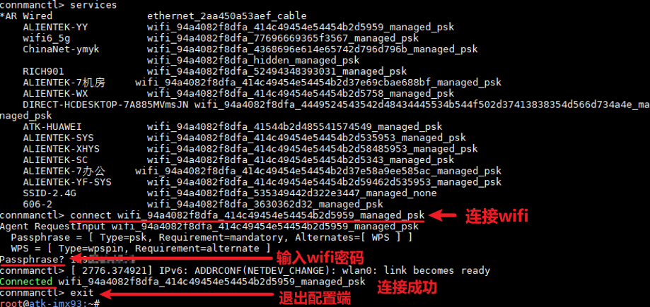
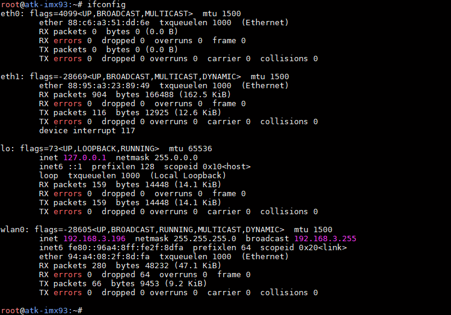
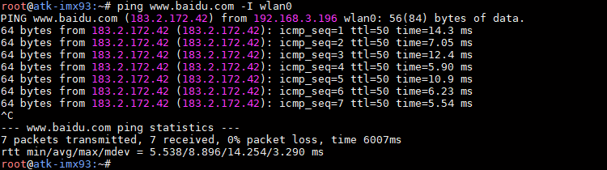
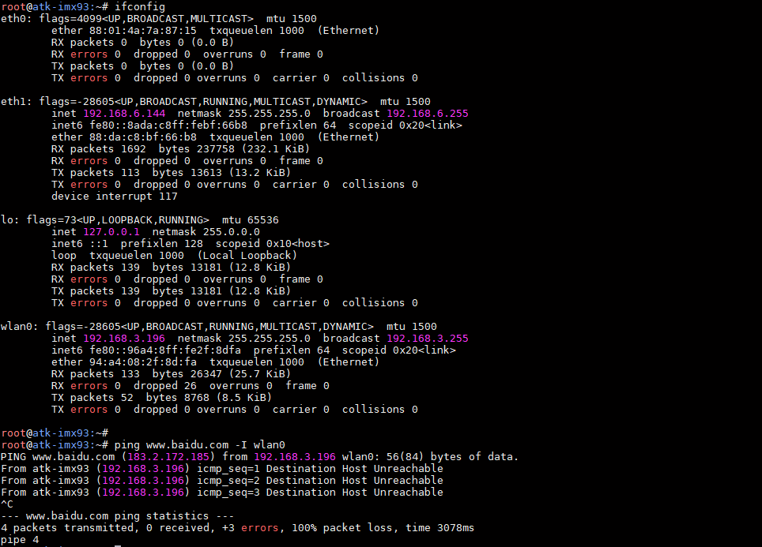
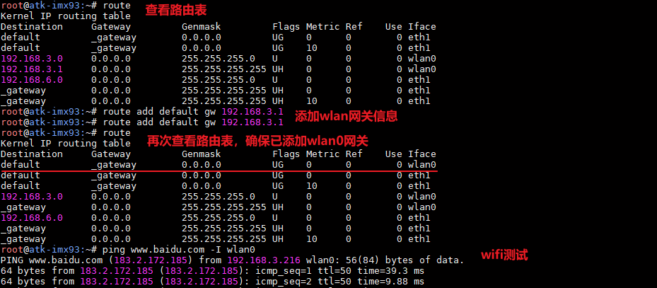

# 4.13 板载SDIO WIFI测试

&emsp;&emsp;ATK-DLIMX93 开发板采用WIFI&蓝牙二合一模组，芯片为RTL8723DS。

&emsp;&emsp;进行WIFI测试之前，请确保开发板上安装好天线，否则无法连接WIFI。

&emsp;&emsp;进入文件系统后，输入下面命令进行WIFI 测试。

```c#
connmanctl
connmanctl> enable wifi
connmanctl> scan wifi
connmanctl> agent on
connmanctl> services
```

&emsp;&emsp;运行结果如下：


<center>
<br />
图 4.13.1 扫描到的热点
</center>

&emsp;&emsp;从扫描到的WIFI 热点列表中，使用命令connect XXXX 进行连接，再输入密码按回车确认。比如示例要连接ALIENTEK-YY，运行结果如下：

<center>
<br />
图 4.13.2 连接热点
</center>

&emsp;&emsp;如上结果，已连接到WIFI 热点，可以用ifconfig 指令查看我们的wlan0 所获取的ip 地址。

<center>
<br />
图 4.13.3查看获取到的ip 地址
</center>

&emsp;&emsp;ping 百度测试连通性，也可以ping 网关来测试WIFI 的连通性。注意，如果ping 不通百度，请不要在开发板接入网线或者其他网络设备，因为系统默认会只让一个网卡连外网。

```c#
ping www.baidu.com -I wlan0
```

<center>
<br />
图 4.13.4 ping百度测试
</center>

&emsp;&emsp;如果接入了网线或者其他网络设备，可以通过删除原本默认的网关地址，再使用route指令添加wifi网关。笔者这里接入网线后，使用wifi连接不了外网，ifconfig信息如下：

<center>
<br />
图 4.13.5 接网线和wifi
</center>

&emsp;&emsp;我们需要先添加wifi的网关地址，再使用route指令查看添加是否成功。

```c#
route                               //查看路由表		
route add default gw 192.168.3.1    //添加wifi网关，按实际信息填写地址
route add default gw 192.168.3.1    //再次添加wifi网关，按实际信息填写地址
route                               //再次查看路由表确认是否只保留wifi网关
```

&emsp;&emsp;可以看到下面default项，已经修改为wifi上网。


<center>
<br />
图 4.13.6 修改路由表为wlan0上网
</center>


