# 4.14 板载蓝牙测试

&emsp;&emsp;ATK-DLIMX93开发板采用WIFI&蓝牙二合一模组，芯片为RTL8723DS，默认将蓝牙串口连接到核心板的UART5。开发板上蓝牙和JTAG存在管脚共用的情况，在使用蓝牙之前，我们需要**将开发板上右下角的SW2拨码开关设置全为ON（拨码往上）**，将管脚切换给蓝牙UART5使用，如下图所示：

<center>
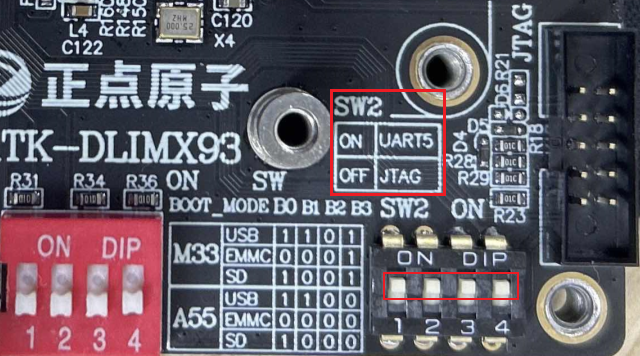<br />
图 4.14.1 SW2拨码开关
</center>

&emsp;&emsp;为了防止蓝牙未完全复位，我们向内核申请一个gpio（这个gpio 硬件连接到蓝牙的上电使能管脚上），设置为输出方向，先给一个低电平，再给一个高电平，这样就可以给蓝牙复位了。

&emsp;&emsp;编者蓝牙初始化脚本atk-bluetooth-init.sh，放在/home/root/shell/bluetooth 下。我们可进入/home/root/shell/bluetooth 目录，运行初始化脚本。

```c#
cd shell/bluetooth/
./atk-bluetooth-init.sh
```

<center>
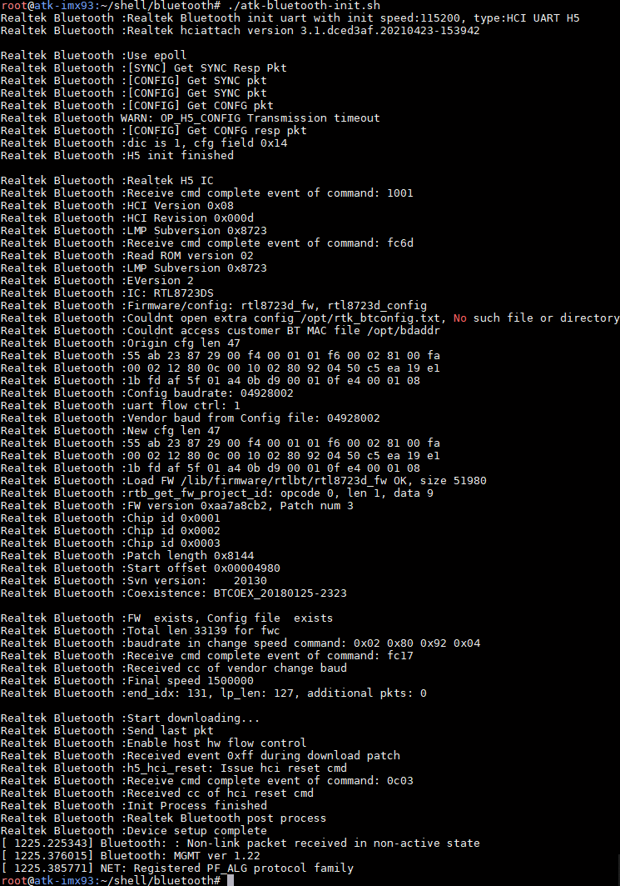<br />
图 4.14.2运行蓝牙脚本
</center>

&emsp;&emsp;运行以下命令可以查看蓝牙的设备

```c#
hciconfig -a
```

<center>
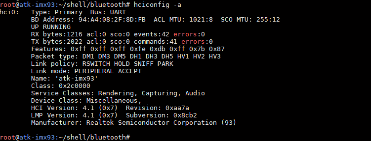<br />
图 4.14.3查看蓝牙设备
</center>

## 4.14.1 蓝牙配对

&emsp;&emsp;蓝牙配对需要用到bluetoothd 服务，bluetoothd 作为系统服务在后台运行，负责管理蓝牙适配器和处理蓝牙设备的连接、配对和通信。它是Linux 系统中与蓝牙相关的核心组件之一。bluetoothd 存放在/usr/libexec/bluetooth 目录下，默认系统运行时已开启，如果需要手动开启可以执行下面命令在后台开启服务。

```c#
/usr/libexec/bluetooth/bluetoothd -C &
```

&emsp;&emsp;输入下面指令，进入bluetoothctl 交互模式。

```c#
bluetoothctl
```

&emsp;&emsp;依次执行下面指令。

```c#
power on           #打开电源
agent on           #开启代理
discoverable on    #开启可被检测
scan on            #开启扫描设备
devices            #当前已扫描搭到的设备
```

<center>
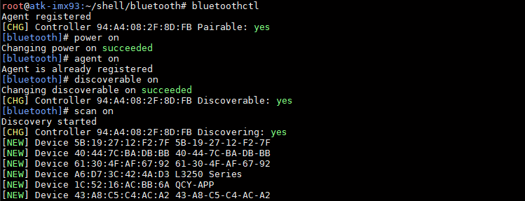<br />
图 4.14.4 配置并运行蓝牙
</center>

&emsp;&emsp;如下图，笔者扫描到自己的安卓手机蓝牙MAC 地址，确认后就可以进行配对了。不同手机系统可能对蓝牙有不同的拦截或者数据保护策略（比如iOS系统），请确保手机蓝牙不被拦截。

<center>
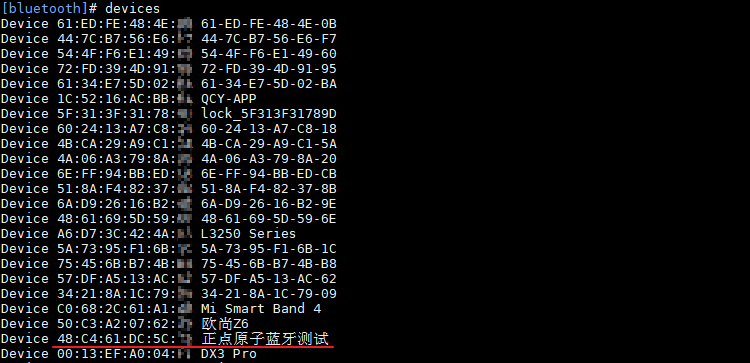<br />
图 4.14.5扫描到蓝牙设备
</center>

&emsp;&emsp;输入下面指令进行配对。

```c#
pair 48:C4:61:DC:5C:78		# 请填写你自己的蓝牙MAC
```

<center>
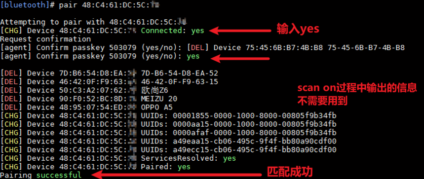<br />
图 4.14.6 确认蓝牙配对请求
</center>

&emsp;&emsp;同时，手机端也选择配对。

<center>
<br />
图 4.14.7 手机端蓝牙配对请求
</center>

&emsp;&emsp;匹配成功后，我们就可以在手机端手动连接开发板蓝牙了。


<center>
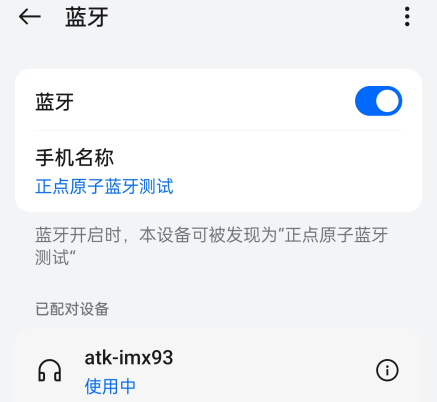<br />
图 4.14.8 手机端连接开发板蓝牙
</center>

&emsp;&emsp;同理，开发板端也会提示蓝牙连接，输入yes确认连接。

<center>
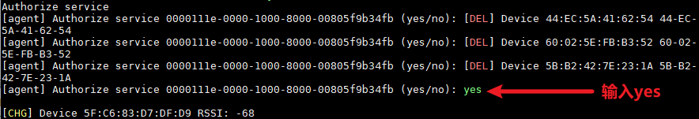<br />
图 4.14.9 开发板确认连接手机蓝牙
</center>

&emsp;&emsp;等到连接到自己的蓝牙设备，输入scan off停止扫描，然后输入exit 退出交互模式。

```c#
scan off
exit
```

<center>
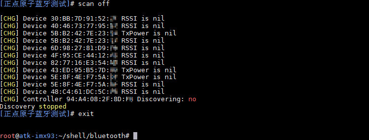<br />
图 4.14.10 退出蓝牙工具
</center>

&emsp;&emsp;使用l2ping工具测试蓝牙连接。此工具需要目标设备蓝牙支持L2CAP回显功能且开启相关的蓝牙权限，在适中距离（一般是十米内）且无明显物理障碍物和电磁干扰源。笔者使用的目标设备是安卓手机。

```c#
l2ping 48:C4:61:DC:5C:78			# 请填写你自己的蓝牙MAC
```

<center>
<br />
图 4.14.11 蓝牙l2ping测试
</center>

## 4.14.2 蓝牙文件传输

&emsp;&emsp;蓝牙初始化成功后。使用下面的指令开启蓝牙。

```c#
hciconfig hci0 up
hciconfig hci0 piscan   // 开启蓝牙被扫描
```

&emsp;&emsp;使用下面指令扫描蓝牙设备，用户先打开手机蓝牙，再使用如下指令扫描。

```c#
hcitool scan
```

<center>
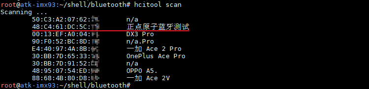<br />
图 4.14.12 扫描蓝牙设备
</center>

&emsp;&emsp;开启obexd 守护进程，设置接收的目录为/home/root/

```c#
/usr/libexec/bluetooth/obexd -r /home/root -a -d &
```

&emsp;&emsp;开启命令行测试工具obexctl

```c#
obexctl
```

&emsp;&emsp;执行下面的指令连接手机，在前面我们已经扫描手机蓝牙，输入下面的指令进行连接手机，格式为connect [MAC]

```c#
connect XX:XX:XX:XX:XX:XX //请输入个人的手机蓝牙MAC 地址
```

<center>
<br />
图 4.14.13 连接蓝牙
</center>

&emsp;&emsp;发送文件到手机，比如/home/root/shell/audio目录下有一个short.mp3文件，（注意传输的文件名称或者类型，同名文件等可能被手机重命名，某些类型的文件可能不能被手机接收）我们将它发送到手机，如下

```c#
send /home/root/shell/audio/short.mp3
```

<center>
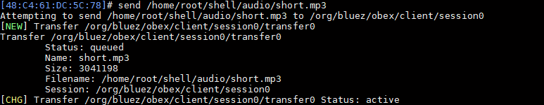<br />
图 4.14.14 执行蓝牙文件传输
</center>

&emsp;&emsp;手机弹窗显示，是否接收来自开发板的文件，点击接受后，可在手机任务栏上查看蓝牙的传输进度。


<center>
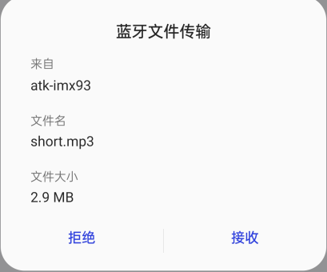<br />
图 4.14.15 手机端确认接收
</center>

&emsp;&emsp;开发板上串口终端打印如下。

<center>
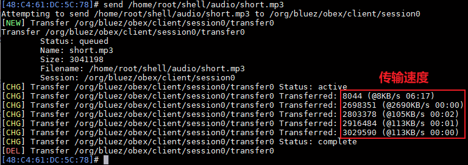<br />
图 4.14.16 蓝牙传输进度
</center>

&emsp;&emsp;传输完成后可以在手机上查看到传过来的文件。

<center>
<br />
图 4.14.17 手机端查看接收到的文件
</center>

