# 4.15 4G 模块EC20 测试

&emsp;&emsp;正点原子ATK-DLIMX93 底板上预留4G 模块接口（MINI PCIE接口），支持正点原子店铺在售的ME3630-W、EC20等4G 模块的安装。

&emsp;&emsp;准备EC20 模块，请在正点原子店铺购买，注意购买时需要买天线，单单模块是不能正常工作的！（备注：EC20 有许多类型模块，目前测试过的是EC20-CE 模块，其中EC20-CE 系列又有多种模块，不同的模块功能不一样，比如支持的运营商不一样，详细请咨询卖家），其他EC20 系列请自行测试，理论上驱动一样，有需求找移远技术支持）。

&emsp;&emsp;将EC20模块插到4G 模块接口处，拧上螺丝。保证4G 模块与座子接口吻合连接。请使用原装天线，把天线连接到4G 模块的MAIN 接口处。


<center>
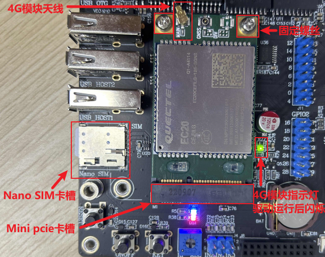<br />
图 4.15.1 开发板4G相关接口
</center>

&emsp;&emsp;正确插入4G 卡（支持的运营商，请咨询对应模块的卖家，注意有些可能模块不支持物联网卡，请使用普通4G 卡测试）及插好模块，开发板启动后底板上的WWAN LED 会亮绿灯。

&emsp;&emsp;如果WWAN LED 绿灯未亮起，请检查模块是否正确连接插入，4G 卡是否插入，天线是否接好，开发板必须插上配带的12V 电源。
4G 模块正常加载后，可以在/dev/下看到有4 个ttyUSB*生成。


```c#
ls /dev/ttyUSB*
```

<center>
<br />
图 4.15.2 查看4G模块的接口
</center>

## 4.15.1 quectel-CM拨号上网

&emsp;&emsp;使用quectel-CM 拨号程序工具（这个工具是我们预先交叉编译好放进文件系统/usr/sbin目录下面的），方便用户使用。此驱动由移远提供，推荐使用此拨号方式。

&emsp;&emsp;输入quectel-CM -h 查看用法。

```c#
quectel-CM -h
```

<center>
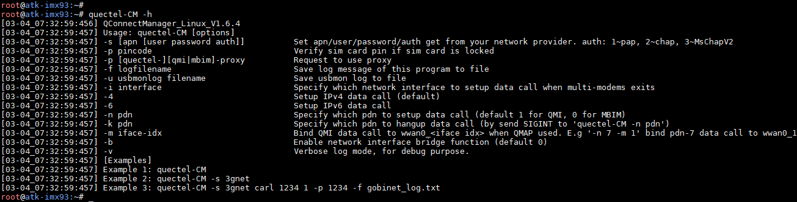<br />
图 4.15.3 查看quectel-CM 工具说明
</center>

&emsp;&emsp;可以看到-s 参数是指定apn 类型，移动卡apn 一般是cmnet，联通卡apn 一般是3gnet，电信卡一般是ctnet。备注：APN 指一种网络接入技术，通常是通过手机上网时必须配置的一个参数，它决定了手机通过哪种接入方式来访问网络。

```c#
quectel-CM &   // 如果不清楚，直接输入quectel-CM，&的作用是后台运行。
```

<center>
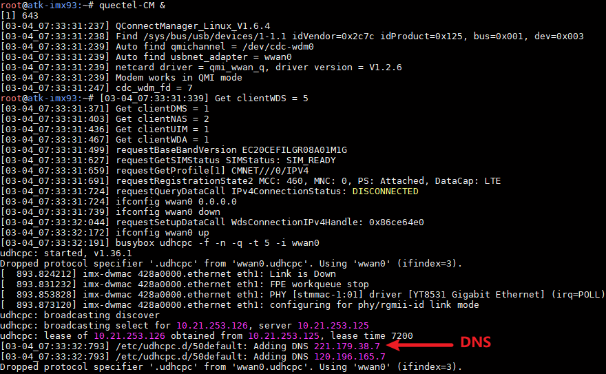<br />
图 4.15.4 通过quectel-CM 工具上网
</center>

&emsp;&emsp;按Enter 回到命令行，输入ifconfig 命令，查看EC20 4G 模块的网络节点名称。wwan0是 EC20 4G 模块的网络节点名称。

<center>
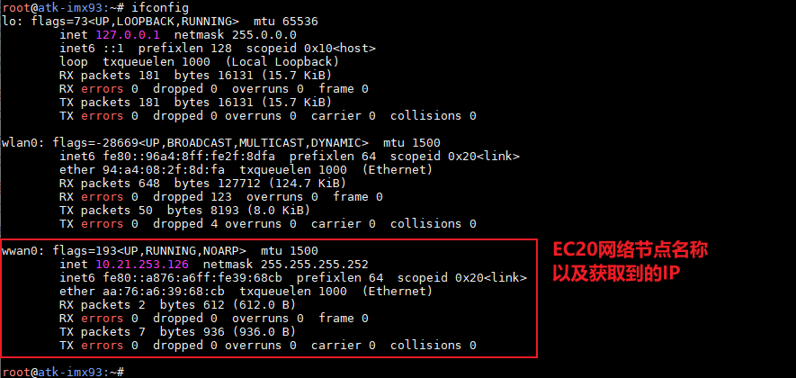<br />
图 4.15.5 获取到的IP
</center>

&emsp;&emsp;ping 百度测试连通性，-I 是指定网卡，有数据回复表示连通。

```c#
ping www.baidu.com -I wwan0
```

&emsp;&emsp;如果提示“bad address 'www.baidu.com”，那么请检查一下DNS 服务器地址是否设置正确，打开/etc/resolv.conf 文件，然后加入上面获取到的DNS 地址，比如笔者的是“221.179.38.7”。

<center>
<br />
图 4.15.6 缺少DNS
</center>

```c#
echo nameserver 221.179.38.7 >> /etc/resolv.conf
```

<center>
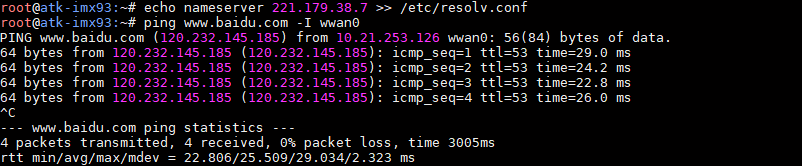<br />
图 4.15.7 添加dns到/etc/resolv.conf并测试
</center>


## 4.15.2 pppd 拨号上网

&emsp;&emsp;出厂文件系统/home/root/shell/4G 目录下已经存放有测试4G 模块的相关脚本。如果前面使用了quectel-CM拨号，请重启系统。

&emsp;&emsp;进入/home/root/shell/4G/目录下。

```c#
cd /home/root/shell/4G/
```

&emsp;&emsp;使用ls 指令可以看到此路径下有多个脚本文件，如果没有这样的文件，请及时更新系统固件。

<center>
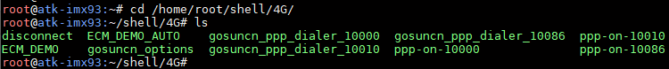<br />
图 4.15.8 查看脚本
</center>

&emsp;&emsp;其中尾缀10000 表示适用于电信卡，10010 表示适用于联通卡，10086 表示适用于移动卡。

&emsp;&emsp;这里以移动卡为例。执行下面ppp-on 脚本，进行4G 模块配置，&的作用是后台运行。

```c#
./ppp-on-10086 &
```

<center>
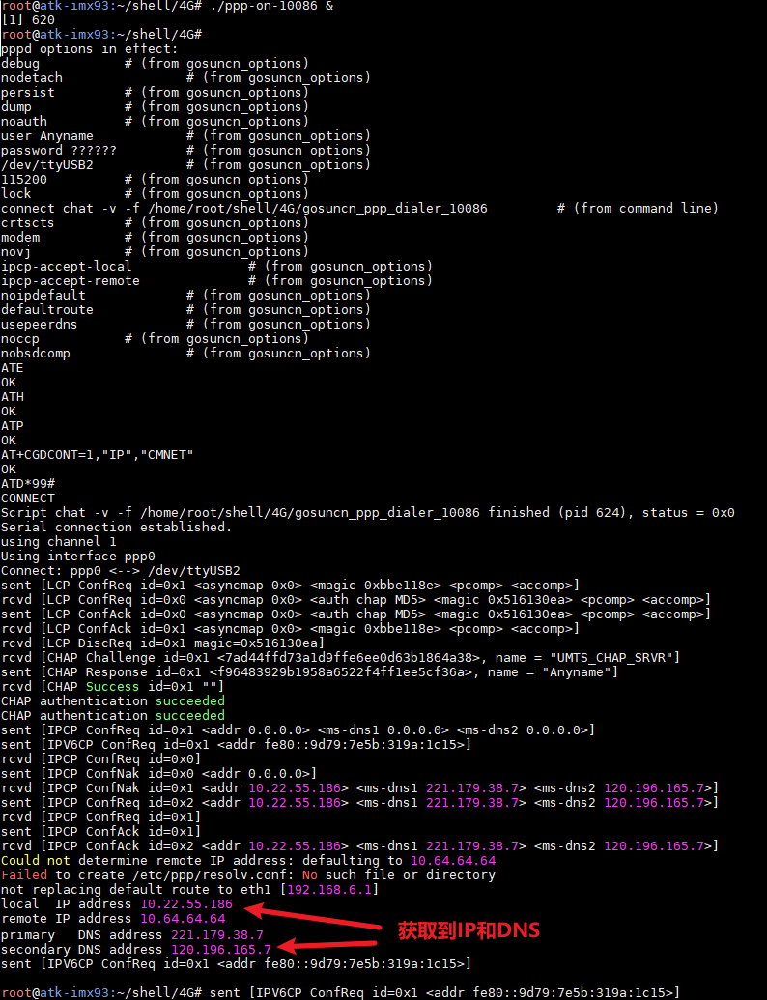<br />
图 4.15.9 ppp 拨号上网获取到IP 和DNS
</center>

&emsp;&emsp;按下Enter 键返回命令行，使用ifconfig 可查看4G 模块的拨号节点名称。

<center>
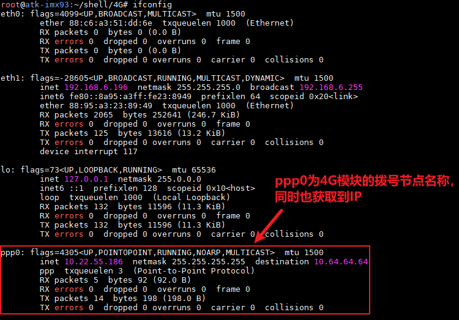<br />
图 4.15.10 查看4G 网络节点名称
</center>

&emsp;&emsp;ping 百度测试连通性，-I 是指定网卡，有数据回复表示连通。按Ctrl+c 终止指令。

```c#
ping www.baidu.com -I ppp0
```

&emsp;&emsp;如果提示“bad address 'www.baidu.com”，那么请检查一下DNS 服务器地址是否设置正确，打开/etc/resolv.conf 文件，然后加入上面获取到的DNS 地址，比如笔者的是“221.179.38.7”。

<center>
<br />
图 4.15.11 缺少DNS
</center>

<center>
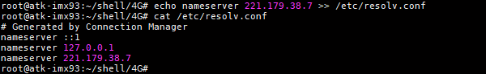<br />
图 4.15.12 添加DNS到/etc/resolv.conf 文件
</center>

<center>
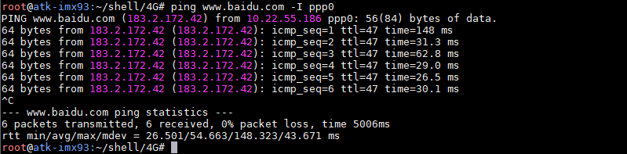<br />
图 4.15.13 ping 百度测试4G 网络连接
</center>

## 4.15.3 GPS功能测试

&emsp;&emsp;EC20还有一个GPS的功能，通过AT指令去设置开启GPS，本小节只教如何开启和查看原始的GPS数据，其它的AT指令请查看开发板光盘A盘-基础资料\04、参考资料\ Quectel_EC2x&EG2x&EG9x&EM05系列_GNSS_应用指导.pdf。

&emsp;&emsp;注意事项：图中有个GPS天线接口，可以购买带有GPS天线版本的EC20，无源天线需要接到GPS接口，天线必须放在室外。

&emsp;&emsp;4G模块正常初始化如下打印信息:

<center>
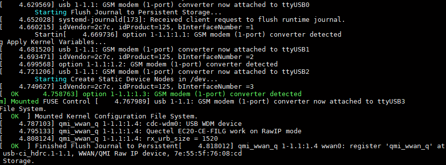<br />
图 4.15.14 模块驱动信息
</center>

&emsp;&emsp;运行以下指令进行使用GPS功能，通过echo命令把AT+QGPS=1数据发送到USB2。

```c#
echo -e "AT+QGPS=1\r\n" >/dev/ttyUSB2
cat /dev/ttyUSB1
```

&emsp;&emsp;等待搜星结束，就可以看到GPS原始数据，参考如下：

<center>
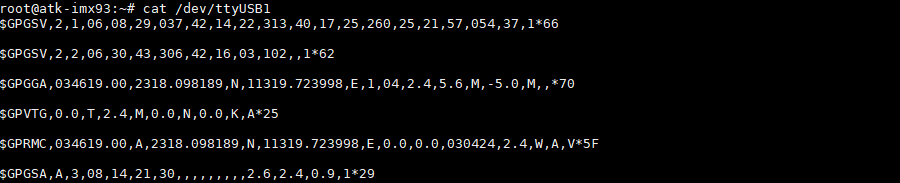<br />
图 4.15.15 GPS原始数据
</center>

&emsp;&emsp;可按“Ctrl + c”终止cat指令，关闭GPS功能可以运行以下代码。

```c#
echo -e "AT+QGPSEND\r\n" >/dev/ttyUSB2
```

&emsp;&emsp;等待几秒钟后GPS功能关闭，这个时候我们可以看到ttyUSB1串口不再打印GPS的原始数据了。

```c#
cat /dev/ttyUSB1
```


