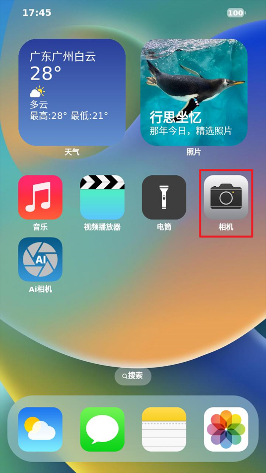

# 4.18 OV5645 摄像头测试

&emsp;&emsp;实验前请准备ov5645 摄像头模块，本公司的任何分辨率的MIPI LCD 电容屏。

&emsp;&emsp;摄像头插法：摄像头镜头往开发板外侧，直接插到MIPI CSI插口处。插摄像头时需要注意看底板丝印，按引脚编号对应插上，即镜头朝向板子外侧。如下图所示：

<center>
<br />
图 4.18.1 摄像头实物连接
</center>

&emsp;&emsp;开机前先插上摄像头和LCD 屏幕（均不支持热插拨），接好设备后再启动开发板。

<center>
<br />
图 4.18.2 启动时ov5645 驱动打印的信息
</center>

&emsp;&emsp;查看ov5645生成的节点，确认节点是video0。

```c#
ls /dev/video0
```

<center>
<br />
图 4.18.3 ov5645节点
</center>

&emsp;&emsp;打开QT 界面的“相机”应用，即可打开OV5645摄像头，进行图像采集。如下图所示。

<center>
<br />
图 4.18.4 Qt界面相机功能
</center>

&emsp;&emsp;Qt界面相机功能默认使用720x480像素，显示界面做成横屏全显，此程序仅供测试参考。

<center>
<br />
图 4.18.5 相机界面预览
</center>

&emsp;&emsp;如果没有屏幕，可以使用拍照指令拍摄照片，然后将照片传到电脑上打开查看。拍照指令如下（下面为一行完整指令，请分行复制并组合！）：

```c#
gst-launch-1.0 v4l2src device=/dev/video0 io-mode=4 num-buffers=1 ! video/x-raw,format=YUY2,width=1920,height=1080,framerate=30/1 ! jpegenc ! filesink location=pic.jpeg
```

<center>
<br />
图 4.18.6 摄像头拍照指令
</center>


&emsp;&emsp;通过SSH或者文件拷贝的形式将拍照得到的图片传输到电脑上打开即可查阅。


