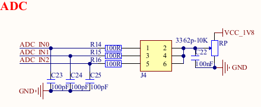
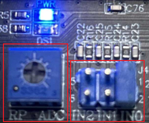

# 4.19 ADC测试

&emsp;&emsp;注意：ADC 的采集电压绝对值最大是1.8V，请不要超过1.8V，否则可能对芯片造成损坏。

&emsp;&emsp;ATK-DLIMX93 底板上J4 处留有一路ADC 方便用户测试。底板原理图如下。


<center>
<br />
图 4.19.1 ADC 底板原理图
</center>

&emsp;&emsp;下图为ATK-DLIMX93开发板的ADC 位置。

<center>
<br />
图 4.19.2 开发板ADC 位置
</center>

&emsp;&emsp;ADC 的主要特性：<br />
&emsp;&emsp;IMX93 支持ADC 功能，提供一个ADC 控制器，它是一款8通道12位1 MS/s 的ADC，其中4个通道连接到处理器中的引脚。

&emsp;&emsp;在Linux 系统中，ADC 采样属于IIO 子系统下，可以通过sysfs 提供的接口来访问ADC 控制器，使用的是12 位精度。

&emsp;&emsp;硬件上确保IN0跳线帽连接，如下图所示：

<center>

</center>

&emsp;&emsp;使用下面的指令来获取ADC1 采样的数据，这里读出里出来的值是原始值raw_value。

```c#
cat /sys/bus/iio/devices/iio\:device0/in_voltage0_raw
```

<center>
<br />
图 4.19.3 查看raw 的值
</center>

&emsp;&emsp;实际电压值(mV)=in_voltage1_raw * in_voltage_scale。

&emsp;&emsp;其中in_voltage_scale为ADC1比例文件(分辨率)，单位为mV，可以通过下面的指令获取，此值跟参考电压有关。

```c#
cat /sys/bus/iio/devices/iio\:device0/in_voltage_scale
```

<center>
<br />
图 4.19.4 查看scale 值
</center>

&emsp;&emsp;那么此时ADC1实际电压值为2105* 0.439453125≈925mV。调节电位计RP_ADC可以调节ADC1电压。

&emsp;&emsp;可以通过切换跳线帽来测试ADC1其他通道的值，读取的通道数据需和实际连接的通道跳线帽相符，否则测试无意义。


<div class="climx93b_center-table-div">
<table class="climx93b_center-table">
  <tr>
    <th>ADC1通道原始值</th>
    <th>底板跳线帽连接</th>
  </tr>
  <tr>
    <td>/sys/bus/iio/devices/iio\:device0/in_voltage0_raw</td>
    <td>IN0</td>
  </tr>
  <tr>
    <td>/sys/bus/iio/devices/iio\:device0/in_voltage1_raw</td>
    <td>IN1</td>
  </tr>
  <tr>
    <td>/sys/bus/iio/devices/iio\:device0/in_voltage2_raw</td>
    <td>IN2</td>
  </tr>
</table>
</div>


