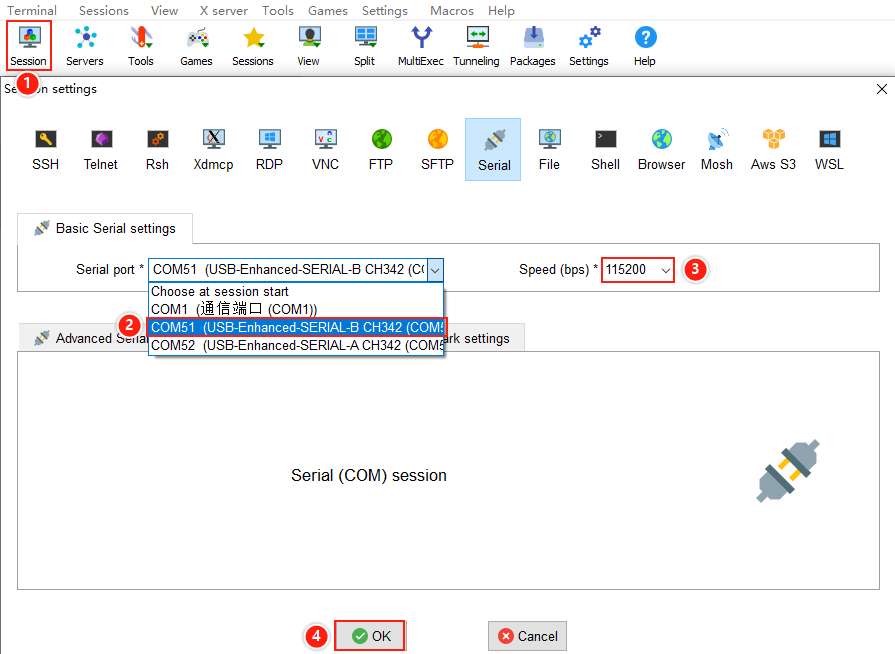
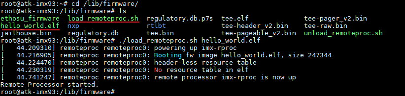
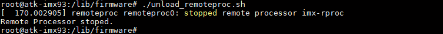

# 4.20 M33核测试

&emsp;&emsp;开发板使用CH342芯片将一路串口分为两路：

&emsp;&emsp;A核串口使用USB-Enhanced-SERIAL-A-CH342，

&emsp;&emsp;M核串口使用USB-Enhanced-SERIAL-B-CH342。

&emsp;&emsp;之前我们讲解一直使用基于A核启动的出厂系统，因此串口选择USB-Enhanced-SERIAL-A-CH342。出厂系统上集成了一个M33的串口打印示例，我们打开一个新的串口终端，串口选择USB-Enhanced-SERIAL-B-CH342，用于显示M核的打印信息，波特率为115200。配置如下：


<center>
<br />
图 4.20.1 M33串口配置
</center>

&emsp;&emsp;返回到出厂系统的串口终端（也就是A核串口终端），在出厂系统中切换到M33测试程序目录下，执行M33例程。

```c#
cd /lib/firmware/
./load_remoteproc.sh hello_world.elf
```

<center>
<br />
图 4.20.2 运行M33测试程序
</center>

&emsp;&emsp;运行程序后，在M核串口终端会打印一句hello world.

<center>
<br />
图 4.20.3 M33打印信息
</center>

&emsp;&emsp;测试完成后，执行下面指令关闭程序。

```c#
./unload_remoteproc.sh
```

<center>
<br />
图 4.20.4 关闭M33测试程序
</center>


