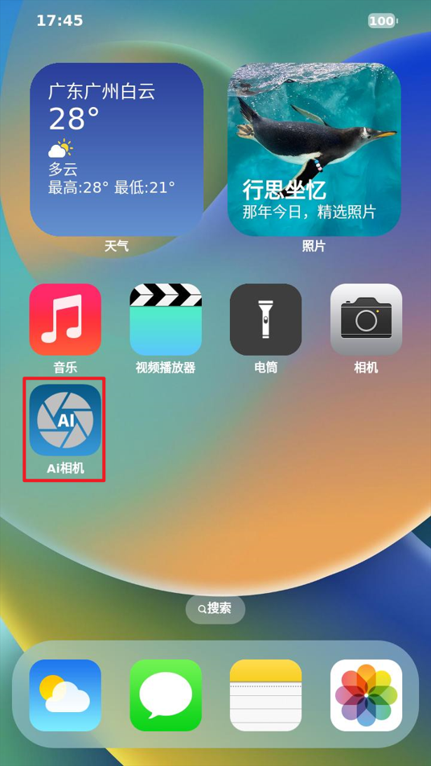
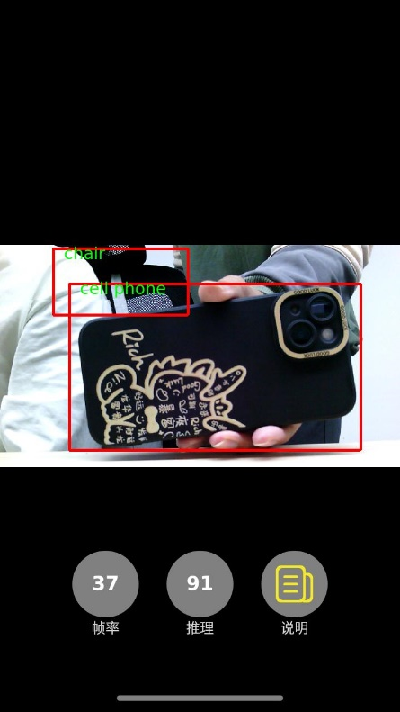

# 4.21 NPU测试

&emsp;&emsp;ATK-DLIMX93开发板出厂系统QT界面集成了一个AI相机的例程，此程序可以用于测试开发板的NPU功能。在使用QT界面的AI相机之前，需将OV5645摄像头和屏幕接到开发板。

 
图 4.21.1 Qt界面-AI相机

&emsp;&emsp;打开主界面的AI相机，此例程使用的是目标检测，效果如下：

 
图 4.21.2 AI相机效果

&emsp;&emsp;更多的AI例程请查看**开发板光盘A盘-基础资料\09、教程文档\《【正点原子】ATK-DLIMX93嵌入式AI开发手册.pdf**

