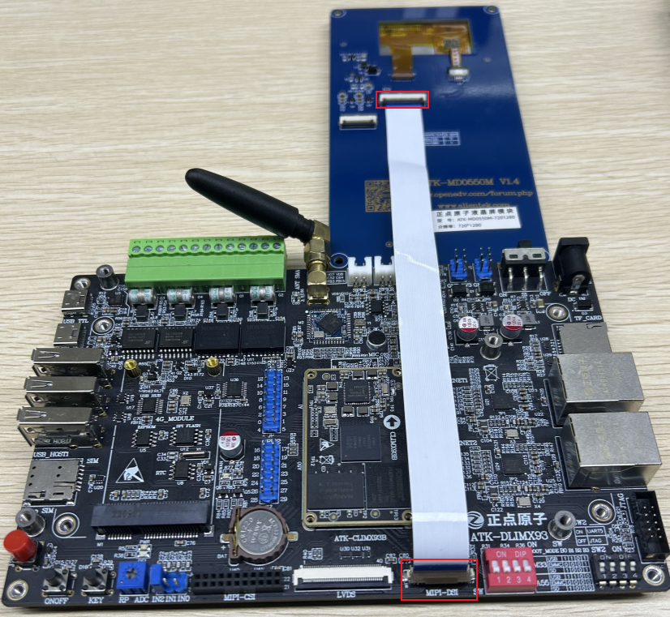
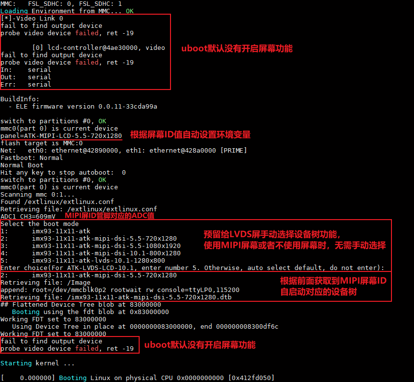

# 4.3 MIPI LCD测试

## 4.3.1  使用说明

&emsp;&emsp;在出厂系统里，因为正点原子的MIPI屏幕排线有ADC管脚连接到CPU上，所以出厂系统会识别加载不同屏的分辨率。正点原子所使用的MIPI屏幕有3个，如下表所示：

<div class="climx93b_center-table-div">
<table class="climx93b_center-table">
  <tr>
    <th>屏幕规格</th>
    <th>触摸芯片</th>
  </tr>
  <tr>
    <td>5.5寸屏（720x1280）</td>
    <td>gt911</td>
  </tr>
  <tr>
    <td>5.5寸屏（1080x1920）</td>
    <td>gt911</td>
  </tr>
  <tr>
    <td>10.1寸屏（800x1280）</td>
    <td>gt911</td>
  </tr>
</table>
</div>

&emsp;&emsp;MIPI屏幕接法：使用屏幕配套的26pin同向FPC排线，接法如下（此图仅为方便展示接口，并非实际摆放效果）。开发板FPC座子夹扣朝上打开即松开，朝下打平即加紧。

<center>
<br />
图 4.3.1开发板和屏幕连接
</center>

&emsp;&emsp;将屏幕接入到开发板后，上电启动开发板，系统默认会根据屏幕ID值选取对应的设备树启动，无需手动修改设备树。在串口终端可以看到具体的屏幕信息，如下图所示：

<center>
<br />
图 4.3.2 uboot打印信息
</center>

&emsp;&emsp;由于uboot功能有限，这里没有做uboot多屏兼容，默认没有开启屏幕功能。

&emsp;&emsp;默认系统会根据正点原子MIPI屏幕的ID管脚电平值去识别屏幕类型，如果使用正点原子MIPI屏幕或者不带屏幕启动，无需手动更改设备树，在Enter choice阶段默认会使用对应的设备树启动，保留Enter choice功能的原因是正点原子LVDS屏幕没有ID管脚，如果是使用正点原子LVDS屏幕可以在此阶段选择LVDS设备树使用。

&emsp;&emsp;不使用屏幕或者使用正点原子MIPI屏幕的用户，如果误触键盘导致在Enter choice阶段停留，需根据屏幕类型手动输入对应的数字后按回车键启动，如果选择的设备树类型不对会导致屏幕显示异常。

&emsp;&emsp;数字类型对应如下：

| **选项** | **对应设备树**                             | **屏幕**                                                    |
| :------: | :----------------------------------------- | :---------------------------------------------------------- |
| 1        | imx93-11x11-atk.dtb                        | 不使用MIPI屏幕，系统根据屏幕ID值自启动设备树                |
| 2        | imx93-11x11-atk-mipi-dsi-5.5-720x1280.dtb  | 正点原子5.5寸720x1280 MIPI屏，系统根据屏幕ID值自启动设备树  |
| 3        | imx93-11x11-atk-mipi-dsi-5.5-1080x1920.dtb | 正点原子5.5寸1080x1920 MIPI屏，系统根据屏幕ID值自启动设备树 |
| 4        | imx93-11x11-atk-mipi-dsi-10.1-800x1280.dtb | 正点原子10.1寸800x1280 MIPI屏，系统根据屏幕ID值自启动设备树 |
| 5        | imx93-11x11-atk-lvds-10.1-1280x800.dtb     | 正点原子10.1寸1280x800 LVDS屏需手动选择设备树启动           |


## 4.3.2 触摸测试

&emsp;&emsp;与4.2 小节方法一样，开发板启动后我们输入cat /proc/bus/input/devices 指令查看触摸屏对应的触摸事件，也可直接在屏幕上进行触摸点击、滑动，测试屏幕是否正常触摸。

&emsp;&emsp;注意：i.MX93处理器不支持MIPI DSI和LVDS同时使用，因此ATK-DLIMX93开发板的MIPI DSI和LVDS也是不可以同时使用的。为节省管脚，开发板MIPI DSI和LVDS屏幕触摸使用同一路管脚，在使用LVDS屏触摸功能前请确保没有接入MIPI屏幕。


## 4.3.3 背光测试
&emsp;&emsp;在默认出厂系统，LCD 屏幕背光支持100个等级的PWM 调节，亮度级数为0～100，默认为100，最亮状态。设置为0 时，关闭背光。数值越大，屏幕越亮。

```c#
cat /sys/class/backlight/backlight/max_brightness    //查看背光最大亮度等级
cat /sys/class/backlight/backlight/brightness        //查看当前亮度等级
echo 50 > /sys/class/backlight/backlight/brightness  //修改当前亮度等级，观察屏的亮度变化
cat /sys/class/backlight/backlight/brightness        //再查看当前亮度等级
```


