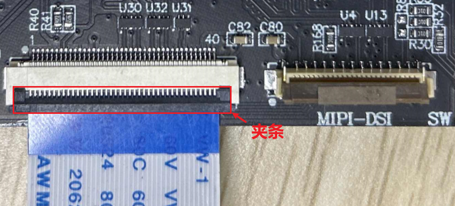
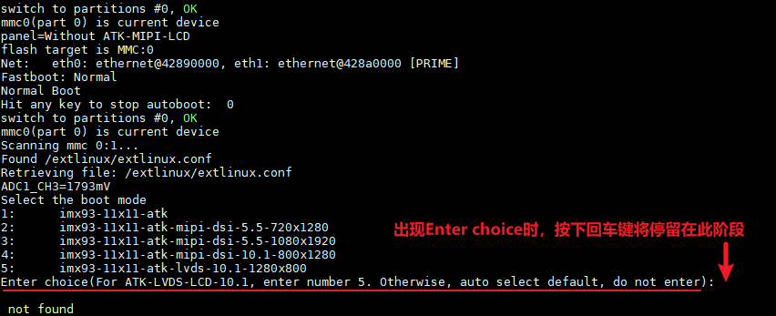
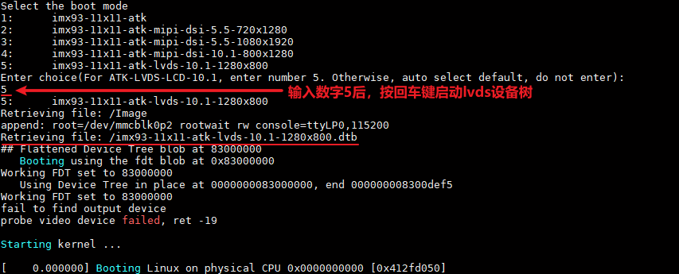

# 4.4 LVDS LCD测试

&emsp;&emsp;此节仅适用于选配了正点原子10.1寸LVDS屏幕的开发板用户。

## 4.4.1 使用说明

&emsp;&emsp;ATK-DLIMX93配置了一路LVDS LCD接口，没有ID识别引脚，我们需要手动选择LVDS的设备树启动。正点原子LVDS屏幕尺寸为10.1寸，分辨率为1280x800。

&emsp;&emsp;LVDS屏接法：屏幕排线使用配套的40pin反向软排线，打开开发板LVDS连接座黑色夹条，排线金属面朝下接入连接座（注意先观察排线金属是否脱落或者短接），合上夹条。屏幕端的排线接法同理。

 
图 4.4.1 开发板LVDS连接座

&emsp;&emsp;开发板接好LVDS屏幕，接好USB_TTL接口后，打开串口终端，启动开发板查看串口信息，当开发板运行到uboot的Enter choice阶段时，按下键盘的Enter键，停留在Enter choice阶段，如下图所示：

 
图 4.4.2 Enter choice阶段

&emsp;&emsp;根据信息提示，我们需要输入数字5后按回车键，使用对应的lvds设备树启动。

 
图 4.4.3启动lvds设备树

&emsp;&emsp;此时观察屏幕，可以看LVDS屏幕启动了。

## 4.4.2 触摸测试

&emsp;&emsp;与4.2 小节方法一样，开发板启动后我们输入cat /proc/bus/input/devices 指令查看触摸屏对应的触摸事件，也可直接在屏幕上进行触摸点击、滑动，测试屏幕是否正常触摸。

&emsp;&emsp;注意：i.MX93处理器不支持MIPI DSI和LVDS同时使用，因此ATK-DLIMX93开发板的MIPI DSI和LVDS也是不可以同时使用的。为节省管脚，开发板MIPI DSI和LVDS屏幕触摸使用同一路管脚，在使用LVDS屏触摸功能前请确保没有接入MIPI屏幕。

## 4.4.3 背光测试

&emsp;&emsp;与4.3.2小节方法一样，这里不再赘述。

