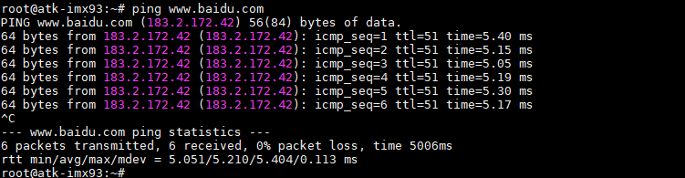

# 4.5 网络测试

&emsp;&emsp;ATK-DLIMX93开发板板载2 路千兆以太网，自适应10/100/1000M 速率。

&emsp;&emsp;首先将网线插入到任一网口处，确保网线能上网，开发板出厂系统将根据本地网络环境自动获取到上网IP 地址（出厂系统支持DHCP），输入ifconfig 命令查看获取到的网络IP。下面举例接入网口ENET1，对应网络节点eth1。而网口ENET2，对应网络节点eth0，测试方法同理。

```c#
ifconfig
```

<center>
<br />
图 4.5.1 eth0 获取外网ip 地址
</center>

&emsp;&emsp;检查网络能否上网，如果有数据回复，则说明网络功能正常。按Ctrl+c 终止指令。

```c#
ping www.baidu.com
```

<center>
<br />
图 4.5.2 ping 百度
</center>

&emsp;&emsp;如果本地网络非上网环境（局域网），则通过配置静态IP 方式来测试网络通信。例如开发板配置网口ENET2 网络静态IP：ifconfig eth0 192.168.6.100。PC（电脑端）配置静态IP192.168.6.200。两者进行局域网ping 通信测试。注意PC（电脑端）需关闭防火墙即可。

## 4.5.2 千兆网络测试

&emsp;&emsp;测试是否为千兆网络，注意要使用千兆网线、千兆路由器或者千兆交换机，PC（电脑端）网卡必须是千兆网卡，否则测试出来的速度或识别出来的速度可能是百兆。

&emsp;&emsp;如下图，当系统识别为1Gbps/Full 则代表是千兆网络。

<center>
<br />
图 4.5.3 识别为千兆网络
</center>

&emsp;&emsp;可使用iperf3 指令测试千兆网络的连接速度，测试前请确保开发板网络能够正常ping 通ubuntu。

&emsp;&emsp;在ubuntu 系统环境下执行如下指令，设置ubuntu 为服务器：

```c#
iperf3 -s
```

&emsp;&emsp;在ATK-DLIMX93 开发板命令行，通过iperf3 指令，输入服务器IP 即可。

&emsp;&emsp;注意，服务器IP 需根据用户ubuntu 的实际IP 来设置，并非统一IP；

```c#
iperf3 -c 192.168.6.206 -i 10
```

&emsp;&emsp;解释：<br />
&emsp;&emsp;（1）-c：客户端。<br />
&emsp;&emsp;（2）192.168.6.206：用户ubuntu 的ip 地址，此处仅为示例。<br />
&emsp;&emsp;（3）-i：触发周期。

&emsp;&emsp;笔者测试出来的Bitrate 大概为900 Mbits/sec 左右，符合千兆网络速度(测试前请不要开启其他应用，以免影响测试速度)。

## 4.5.3 SSH登陆测试

&emsp;&emsp;在前面章节测试完网络后，可以在同一网段的局域网内使用SSH登陆开发板（前提是当前电脑能ping通开发板的IP，并开启SSH功能）。执行ifconfig查看当前开发板的IP地址。

```c#
ifconfig
```

<center>
<br />
图 4.5.4 查看开发板IP地址
</center>

&emsp;&emsp;使用SSH指令登陆开发板，示例：

```c#
ssh root@192.168.6.204
```

&emsp;&emsp;root为开发板的用户名，默认为root。@后面是开发板的IP地址，请根据实际情况填写。

&emsp;&emsp;如果出现“`WARNING: REMOTE HOST IDENTIFICATION HAS CHANGED!`”提示，请执行提示的指令ssh-keygen -f "/home/alientek/.ssh/known_hosts" -R "192.168.6.204"后再重新执行SSH登陆指令。提示是否连接时请输入**yes**并按回车键确认。默认系统是自动登陆无需密码，如果提示需要密码，可以输入密码，用户名和密码都是root。

<center>
<br />
图 4.5.5 SSH登陆开发板
</center>

&emsp;&emsp;MobaXterm终端也可以有SSH终端登陆功能，默认SSH终端为22，操作如下图所示：

<center>
<br />
图 4.5.6 MobaXterm终端SSH登陆
</center>


