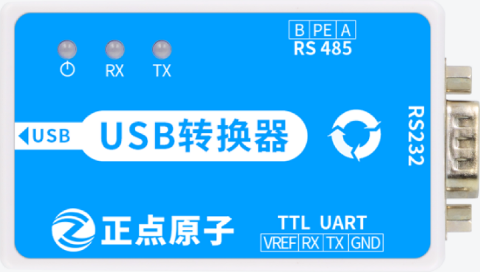
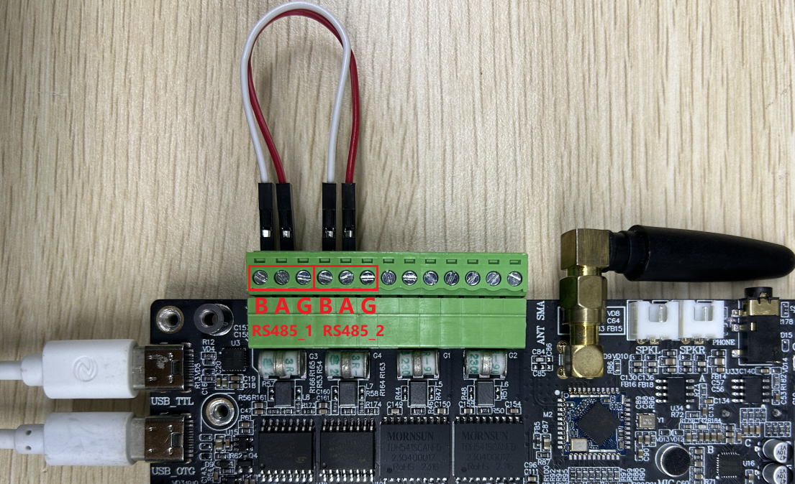
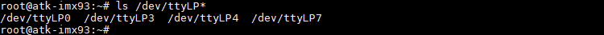
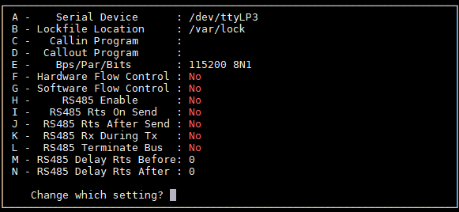
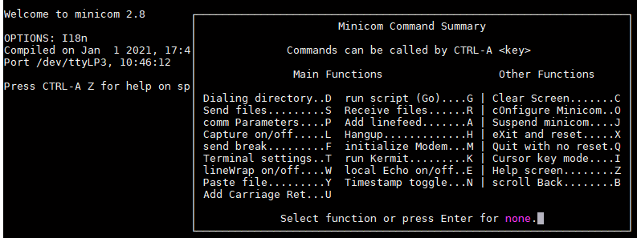
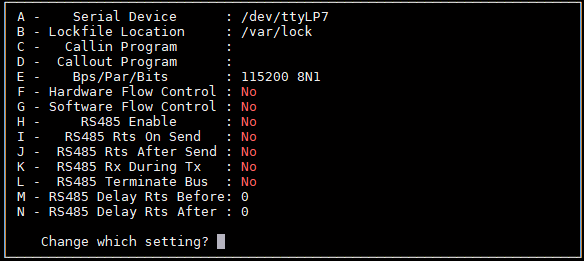
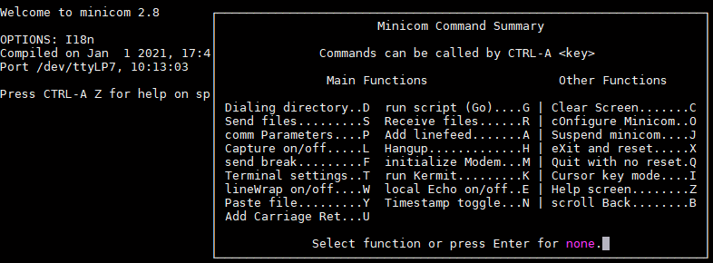
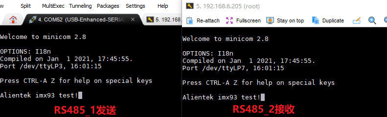

# 4.6 串口测试

&emsp;&emsp;ATK-DLIMX93开发板板载2路RS485，测试前需要准备正点原子USB转换器来完成测试，如下图所示：

<center>
<br />
图 4.6.1正点原子多合一USB 转换器模块
</center>

&emsp;&emsp;如果有其他RS485相关测试可以自行测试，不一定要用这个模块。由于开发板有2路RS485，我们也可以使用这2路RS485互相通信完成测试。下面演示2路RS485互相收发测试。

&emsp;&emsp;将RS485_1的A端接在RS485_2的A端，将RS485_1的B端接在RS485_2的B端，如下图所示。


<center>
<br />
图 4.6.2两路RS485相连
</center>

&emsp;&emsp;由于需要开启两个终端才能看具体的收发信息，开发板板载的一路USB_TTL已经不够满足，因此我们需要通过SSH登陆来查看。开发板SSH登陆请查看第4.5.3小节。
执行下面指令可以查看开发板默认开启的串口设备：

```c#
ls /dev/ttyLP*
```

<center>
<br />
图 4.6.3开发板默认串口设备
</center>

&emsp;&emsp;串口设备对应外设信息如下表所示：

<div class="climx93b_center-table-div">
<table class="climx93b_center-table">
  <tr>
    <th>串口设备</th>
    <th>开发板外设</th>
  </tr>
  <tr>
    <td>/dev/ttyLP0</td>
    <td>USB_TTL（LPUART1）</td>
  </tr>
  <tr>
    <td>/dev/ttyLP3</td>
    <td>RS485_1（LPUART4）</td>
  </tr>
  <tr>
    <td>/dev/ttyLP4</td>
    <td>蓝牙（LPUART5）</td>
  </tr>
  <tr>
    <td>/dev/ttyLP7</td>
    <td>RS485_2（LPUART8）</td>
  </tr>
</table>
</div>


&emsp;&emsp;在串口终端使用minicom -s配置并打开RS485_1，配置如下图所示：

<center>
<br />
图 4.6.4配置RS485_1
</center>


&emsp;&emsp;按下键盘crtl+A后再按Z，进入minicom菜单界面，按E开启输入回显。

<center>
<br />
图 4.6.5 RS485_1开启输入回显
</center>

&emsp;&emsp;在SSH端使用minicom -s配置并打开RS485_2，配置如下图所示：

<center>
<br />
图 4.6.6 配置RS485_2
</center>

&emsp;&emsp;按下键盘crtl+A后再按Z，进入minicom菜单界面，按E开启输入回显。

<center>
<br />
图 4.6.7 RS485_2开启输入回显
</center>

&emsp;&emsp;在RS485_1终端输入字符，在RS485_2端会显示对应的字符（同理RS485_2发送，在RS485_1会接收），如下图所示：

<center>
<br />
图 4.6.8 RS485测试
</center>


