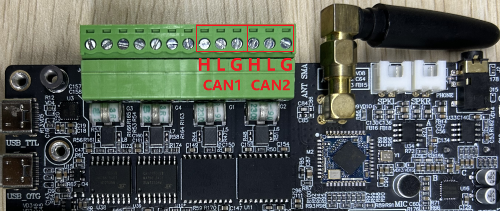
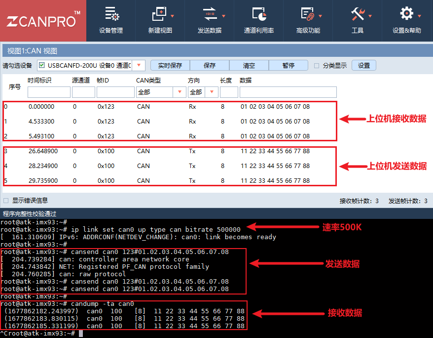
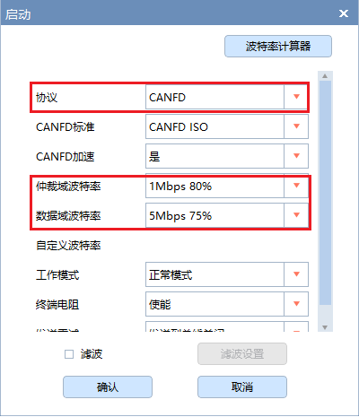
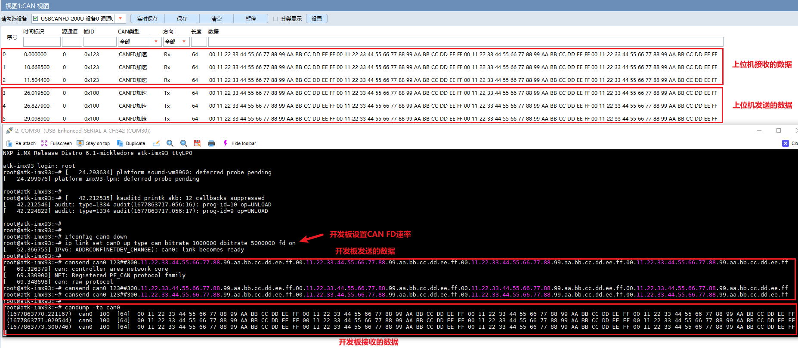
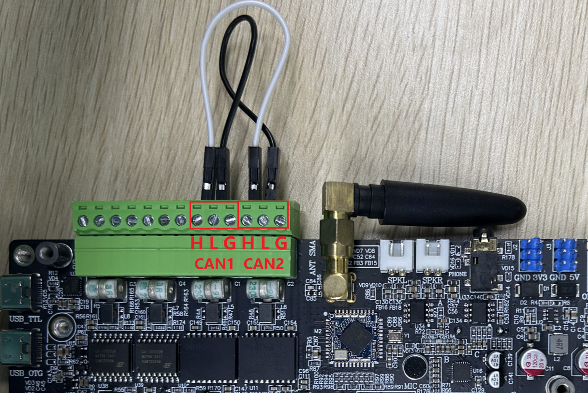
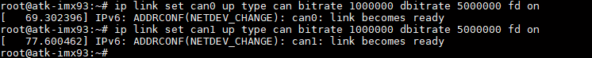
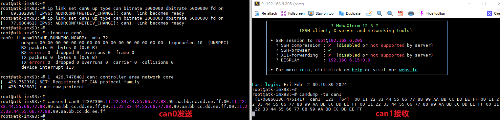

# 4.7 CAN测试

&emsp;&emsp;ATK-DLIMX93 开发板板载2 路CAN（均支持CAN FD）。在测试CAN 之前，需要准备好测试CAN 的仪器，比如周立功的CAN 分析仪、创芯科技的CAN 分析仪和广成科技的CAN 分析仪等，否则只能用两块不同开发板的CAN 或者其他CAN 设备测试。关于CAN 仪器及CAN上位机的使用，请参照各厂商产品的使用说明书。

&emsp;&emsp;开发板所使用的CAN 的主要特性如下：<br />
&emsp;&emsp;- 支持CAN FD，可以理解成CAN 协议的升级版，只升级了协议，物理层未改变。<br />
&emsp;&emsp;- CAN与CAN FD主要区别：传输速率不同、数据长度不同、帧格式不同、ID长度不同。<br />
&emsp;&emsp;数据比特率最高5Mbps。

&emsp;&emsp;测试前请将CAN 分析仪或者测试CAN 的设备连接到ATK-DLIMX93开发板的CAN 接口，CANH 端连接CAN 仪器的CANH，CANL 端连接CAN 仪器的CANL。

&emsp;&emsp;下面举例使用FDCAN1 接口来进行CAN 功能测试，FDCAN2 同理。开发板CAN 接口如下图所示。

<center>
<br />
图 4.7.1CAN接口位置
</center>

&emsp;&emsp;系统中对应的CAN设备如下：

<div class="climx93b_center-table-div">
<table class="climx93b_center-table">
  <tr>
    <th>外设接口</th>
    <th>系统接口</th>
  </tr>
  <tr>
    <td>CAN1</td>
    <td>can0</td>
  </tr>
  <tr>
    <td>CAN2</td>
    <td>can1</td>
  </tr>
</table>
</div>

## 4.7.1 CAN 测试

&emsp;&emsp;CAN 最低数据比特率10kBit/s，最高数据比特率1000kBit/s。

&emsp;&emsp;测试前提示一下，下面示例指令，是基于FDCAN1 接口测试，对应系统设备名称为can0。

&emsp;&emsp;若用户需要测试FDCAN2 接口，则对应系统设备名称为can1，注意修改指令即可。

&emsp;&emsp;示例FDCAN1 接口，配置can0 数据比特率为500kBit/s。

```c#
ip link set can0 up type can bitrate 500000
```

&emsp;&emsp;使用cansend 指令发送数据。

```c#
cansend can0 123#01.02.03.04.05.06.07.08
```

&emsp;&emsp;解释：<br />
&emsp;&emsp;（1）can0：can0 表示FDCAN1 接口设备，can1 表示FDCAN2 接口设备。<br />
&emsp;&emsp;（2）123：帧ID<br />
&emsp;&emsp;（3）01.02.03.04.05.06.07.08：帧数据<br />

&emsp;&emsp;使用candump 指令接收数据。按Ctrl+c 终止指令。

```c#
candump -ta can0
```

&emsp;&emsp;解释：<br />
&emsp;&emsp;（1）-ta: t 代表打印时间，a 代表开启ASCII 输出。

&emsp;&emsp;下面使用广成科技CAN 分析仪，设置CAN 的速率为500000，测试结果如下图。


<center>
<br />
图 4.7.2 使用上位机与开发板进行CAN 收发通信
</center>

## 4.7.2 CAN FD测试

&emsp;&emsp;下面采用广成科技的CAN 测试设备（支持CAN FD），进行CAN FD 测试。如果CAN 测试设备不支持CAN FD 功能，则不能用于测试CAN FD。

&emsp;&emsp;开发板的CAN FD 波特率最高为1000 kBit/s，数据波特率为5000 kBit/s。可用的速率如下，如需要使用更低的波特率，请使用CAN，而非CAN FD。

&emsp;&emsp;测试前提示一下，下面示例指令，是基于FDCAN1 接口测试，对应系统设备名称为can0。若用户需要测试CAN2 接口，则对应系统设备名称为can1，注意修改指令即可。

&emsp;&emsp;设置不同速率时，需要先关闭CAN 设备，再设置CAN 的速率，如果设置不成功，请重启板子或者上位机软件。

```c#
ifconfig can0 down
```

&emsp;&emsp;这里提供配置CAN FD 的速率示例。

```c#
ip link set can0 up type can bitrate 1000000 dbitrate 5000000 fd on
```

&emsp;&emsp;此处设置波特率为1000 kBit/s，数据波特率为5000 kBit/s 进行测试。

<center>
<br />
图 4.7.3 开发板设置CAN FD 速率
</center>

<center>
<br />
图 4.7.4 上位机配置
</center>

&emsp;&emsp;使用cansend 命令发送数据，下面为一行完整指令，请分行复制并组合！

```c#
cansend can0 123##300.11.22.33.44.55.66.77.88.99.aa.bb.cc.dd.ee.ff.00.11.22.33.44.55.66.77.88.99.aa.bb.cc.dd.ee.ff.00.11.22.33.44.55.66.77.88.99.aa.bb.cc.dd.ee.ff.00.11.22.33.44.55.66.77.88.99.aa.bb.cc.dd.ee.ff
```

&emsp;&emsp;解释：<br />
&emsp;&emsp;（1）can0: can0 表示FDCAN1 接口设备，can1 表示FDCAN2 接口设备。<br />
&emsp;&emsp;（2）123: 帧ID<br />
&emsp;&emsp;（3）3：标志（flags）<br />
&emsp;&emsp;（4）00.11.22…: 帧数据

&emsp;&emsp;使用candump 指令接收数据。按Ctrl+c 终止指令。

```c#
candump -ta can0
```

&emsp;&emsp;解释：<br />
&emsp;&emsp;（1）-ta: t 代表打印时间，a 代表开启ASCII 输出

&emsp;&emsp;开发板CAN FD 测试结果如下图。

<center>
<br />
图 4.7.5 使用上位机与开发板进行CAN FD 收发通信
</center>

## 4.7.3 板载双路CANFD测试

&emsp;&emsp;由于开发板有2路CANFD ，我们也可以使用这2路CANFD互相通信完成测试。下面演示2路CANFD互相收发测试。

&emsp;&emsp;将CAN1的H端接在CAN2的H端，将CAN1的L端接在CAN2的L端，如下图所示。

<center>
<br />
图 4.7.6 板载CAN互连
</center>

&emsp;&emsp;由于需要开启两个终端才能看具体的收发信息，开发板板载的一路USB_TTL已经不够满足，因此我们需要通过SSH登陆来查看。开发板SSH登陆请查看第4.5.3小节。

&emsp;&emsp;执行下面指令可以开启并配置can0和can1：

```c#
ip link set can0 up type can bitrate 1000000 dbitrate 5000000 fd on
ip link set can1 up type can bitrate 1000000 dbitrate 5000000 fd on
```

&emsp;&emsp;此处设置波特率为1000 kBit/s，数据波特率为5000 kBit/s 进行测试。

<center>
<br />
图 4.7.7 开启can0和can1
</center>

&emsp;&emsp;在SSH端登陆开发板，执行下面指令，让can1使用candump 指令接收can0数据。按Ctrl+c 终止指令。

```c#
candump -ta can1
```

&emsp;&emsp;解释：<br />
&emsp;&emsp;（1）-ta: t 代表打印时间，a 代表开启ASCII 输出

&emsp;&emsp;串口端执行下面这条指令，让can0使用cansend 命令发送数据，下面为一行完整指令，请分行复制并组合！

```c#
cansend can0 123##300.11.22.33.44.55.66.77.88.99.aa.bb.cc.dd.ee.ff.00.11.22.33.44.55.66.77.88.99.aa.bb.cc.dd.ee.ff.00.11.22.33.44.55.66.77.88.99.aa.bb.cc.dd.ee.ff.00.11.22.33.44.55.66.77.88.99.aa.bb.cc.dd.ee.ff
```

&emsp;&emsp;解释：<br />
&emsp;&emsp;（1）can0: can0 表示FDCAN1 接口设备。<br />
&emsp;&emsp;（2）123: 帧ID<br />
&emsp;&emsp;（3）3：标志（flags）<br />
&emsp;&emsp;（4）00.11.22…: 帧数据

&emsp;&emsp;测试结果如下：

<center>
<br />
图 4.7.8 can测试
</center>

