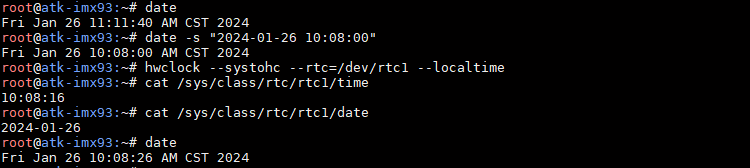

# 4.9 RTC 时钟测试

&emsp;&emsp;ATK-DLIMX93开发板有两个硬件时钟，一个是核心板上的芯片内部的RTC时钟（/sys/class/rtc/rtc0），开发板掉电不保存时间数据和计时。另外一个是底板上RTC时钟芯片PCF8563属于芯片外部RTC时钟（/sys/class/rtc/rtc1），由RTC纽扣电池供电，开发板掉电仍保存时间和计时。若需要提高时钟的精度，需要用高精度的晶振。

&emsp;&emsp;请检查开发板底板上是否有安装RTC纽扣电池。也可以用万用表检查RTC电池有没有电，测出来是3.3v左右才是正常的。防止因RTC电池没电不能保存时间。（注意，电池属于易耗品，若没电请更换纽扣电池）

&emsp;&emsp;Linux系统分两个时钟，一个是system time（软件时钟），一个是hardware clock（硬件时钟）。使用date和hwclock命令可分别查看和设定系统时间和硬件时间。系统时钟掉电即会消失，RTC 时钟在有电池的情况下会长期运行。系统时钟会在系统重启时与 RTC 时钟同步。

&emsp;&emsp;查看系统时钟，使用指令date。注意出厂系统系统时钟使用了ntpd时钟同步服务，所以你开机时如果有插上网线，并且能联网，那么你的系统时钟将会与网络上的时钟同步。但是这个同步的时钟并不会写入到硬件时钟里。所以你用date和hwclock可能会看到两个不同的时间。

```c#
date
```

&emsp;&emsp;给PCF8563写入时间：

```c#
date -s "2024-01-26 10:08:00"
hwclock --systohc --rtc=/dev/rtc1 --localtime
```

&emsp;&emsp;查询PCF8563时间：

```c#
cat /sys/class/rtc/rtc1/time
cat /sys/class/rtc/rtc1/date
date
```

<center>
<br />
图 4.9.1 设置RTC时间
</center>

&emsp;&emsp;可以看到系统时间和RTC时间一致。因为系统时间是CST的，使用12小时制，如果写入的是17:00:00，那么显示的就是05:00:00 PM。

&emsp;&emsp;如果开发板联网的话，系统可以通过网络获取时间，这样时间更精准，默认系统启动时会自动获取网络时间。如果要重新获取网络时间，可以执行下面指令：

```c#
systemctl restart ntpd
```

&emsp;&emsp;稍等片刻后，就可以查看系统时间，此时系统时间和网络时间一致。

```c#
date
```

&emsp;&emsp;获取到的网络时间是不会自动写入RTC时间的，修改RTC时间需要按之前的指令重新写入。

