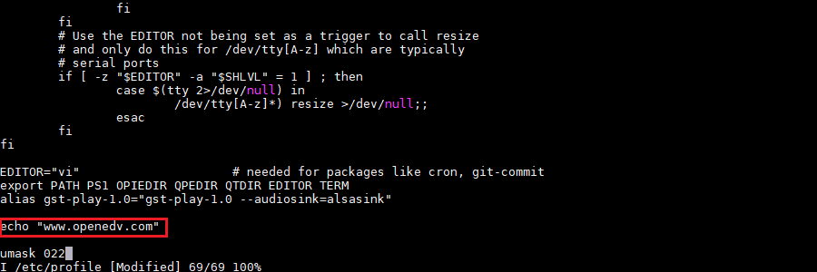
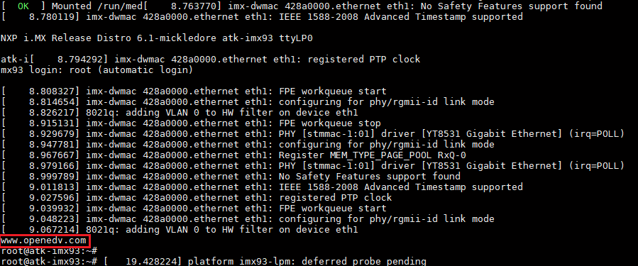

# 5.4 如何创建自启动程序

&emsp;&emsp;系统开机会自动执行/etc/profile且这个文件执行的时间为刚登入系统前，所以我们可以将自启动的写到这个文件中。

```c#
vi /etc/profile
```

&emsp;&emsp;输入echo "www.openedv.com"如下位置。


<center>
<br />
图 5.4.1 添加打印到/etc/profile
</center>


&emsp;&emsp;保存文件后，重启开发板后，在串口终端打印如下。打印出“www.openedv.com”。


<center>
<br />
图 5.4.2 自启动效果
</center>

&emsp;&emsp;如果是想运行自己的Qt 程序的，可以参考下面的格式，比如笔者这里/home/root/路径下的一个Qt 可执行文件名为demo

```c#
systemctl disable systemui.service
systemctl stop systemui.service
/home/root/demo >/dev/null 2>&1 &
```


