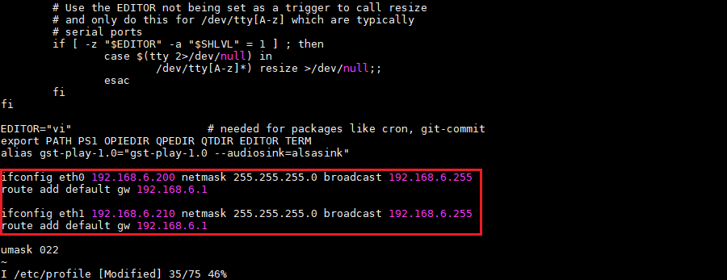
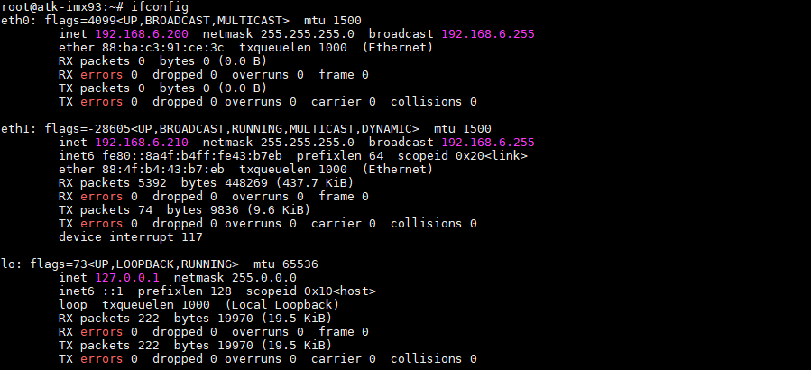

# 5.5 如何设置静态ip

&emsp;&emsp;在出厂文件系统的/etc/profile文件的末尾添加以下代码，确保开机时指定网络接口以静态IP 地址启动。以下为示例：

```c#
ifconfig eth0 192.168.6.200 netmask 255.255.255.0 broadcast 192.168.6.255
route add default gw 192.168.6.1

ifconfig eth1 192.168.6.210 netmask 255.255.255.0 broadcast 192.168.6.255
route add default gw 192.168.6.1
```

<center>
<br />
图 5.5.1 添加静态IP地址示例
</center>


&emsp;&emsp;这段代码的作用是在系统启动时使用ifconfig 命令来设置"eth0" 和"eth1"网络接口的IP 地址为192.168.6.200和192.168.6.210，子网掩码为255.255.255.0，广播地址为192.168.6.255，并启用这两个接口。然后使用route 命令添加默认网关，将所有外部流量路由到192.168.6.1。

&emsp;&emsp;确保将这段代码添加到/etc/profile文件的末尾，并保存/etc/profile文件。当系统重新启动时，它将自动执行这些配置命令，使"eth0"和 "eth1"网络接口按照命令内容进行配置，默认使能网口，在实际测试时需要接好网线。在实际环境中，您应该使用您的网络分配的正确IP 地址和默认网关，并确保IP地址不冲突。


<center>
<br />
图 5.5.2 静态IP效果
</center>


