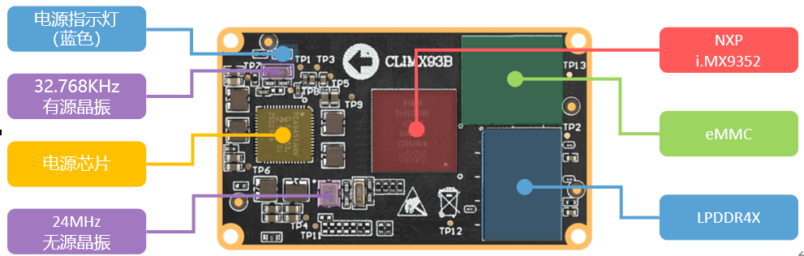
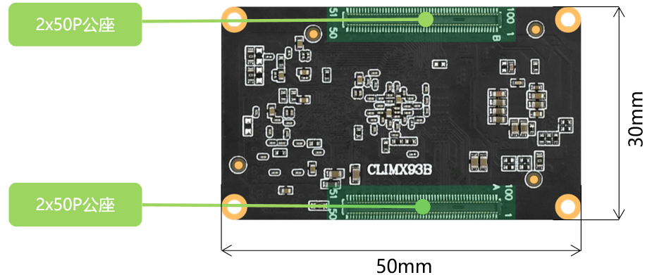
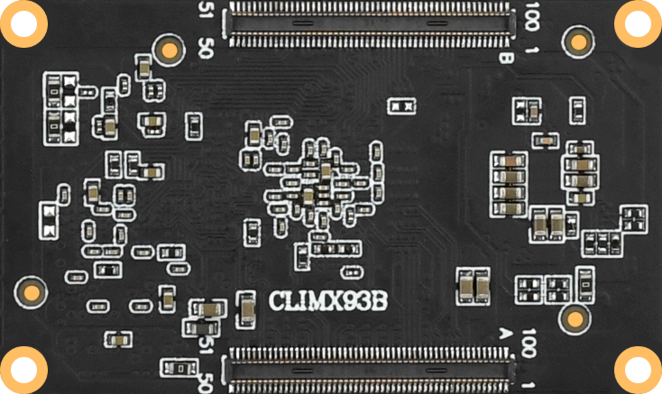
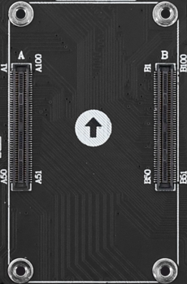
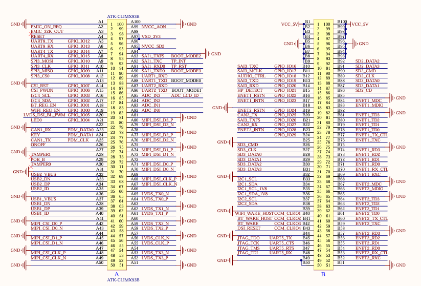

# 3.1 硬件参数

<table class="climx93b_center-table">
  <tr>
    <th>项目</th>
    <th>参数</th>
    <th>备注</th>
  </tr>
  <tr>
    <td>核心板尺寸规格</td>
    <td>50mm*30mm</td>
    <td> </td>
  </tr>
  <tr>
    <td>处理器型号</td>
    <td>NXP i.MX9352</td>
    <td>FCBGA306封装</td>
  </tr>
  <tr>
    <td>处理器架构</td>
    <td>双核1.7GHz Cortex-A55 + 250MHz Cortex-M33，集成0.5 TOP/s NPU</td>
    <td> </td>
  </tr>
  <tr>
    <td>电源管理</td>
    <td>分立电源</td>
    <td> </td>
  </tr>
  <tr>
    <td>内存</td>
    <td>1GB LPDDR4X（标配）</td>
    <td>型号以实际贴片为准</td>
  </tr>
  <tr>
    <td>存储</td>
    <td>16GB eMMC（标配）</td>
    <td>型号以实际贴片为准</td>
  </tr>
  <tr>
    <td>工作电压</td>
    <td>5V1A</td>
    <td>供电范围：5V±200mV</td>
  </tr>
  <tr>
    <td>功耗</td>
    <td>< 1W</td>
    <td>核心板最小系统功耗</td>
  </tr>
  <tr>
    <td>工作温度</td>
    <td>商业级：-25℃ ~ +70℃</td>
    <td> </td>
  </tr>
  <tr>
    <td>工作温度</td>
    <td>工业级：-40℃ ~ +85℃</td>
    <td> </td>
  </tr>
  <tr>
    <td>接口管脚数</td>
    <td>200PIN</td>
    <td> </td>
  </tr>
  <tr>
    <td>管脚间距</td>
    <td>0.4mm</td>
    <td> </td>
  </tr>
  <tr>
    <td>接口形式</td>
    <td>两个2*50的防反插BTB公座，板对板连接</td>
    <td> </td>
  </tr>
  <tr>
    <td>PCB 工艺</td>
    <td>8层，单独地层、电源层</td>
    <td> </td>
  </tr>
</table>

# 3.2 核心板资源

 
图 3.2.1 CLIMX93B核心板正面资源

 
图 3.2.2 CLIMX93B核心板背面资源

# 3.3 管脚顺序及接口信号

&emsp;&emsp;在ATK-CLIMX93B 核心板原理图的 PINOUT 部分就是核心板 BTB 连接器对应的管脚定义，此连接器是一对2x50PIN的规格，一共有200个管脚。 

&emsp;&emsp;核心板背面有管脚序号丝印，如下所示：

 
图 3.3.1核心板背面

&emsp;&emsp;可以看到核心板背面上有一对BTB连接器公座，上面的是B，下面的是A，分别标有1、50、51、100管脚号，**和底板上的BTB母座管脚号一一对应**。

 
图 3.3.2开发板底板BTB接口

&emsp;&emsp;具体管脚功能定义，可以查看ATK-DLIMX93底板原理图的。

 
图 3.3.3底板原理图管脚定义部分

&emsp;&emsp;这里只写了核心板在底板上使用的功能（也就是默认出厂系统功能），如果想要查看管脚可复用功能，**请查看文档《【正点原子】ATK-DLIMX93核心板接口数据手册.xlsx》**。

# 3.3.1 管脚可复用功能资源

&emsp;&emsp;核心板引出了处理器上的所有IO，用户可以根据自己需要，自行设计底板来运用核心板上IO资源，将IO复用成自己所需要的功能。 

&emsp;&emsp;根据外设功能，此处列举ATK-CLIMX93B系列核心板可复用的单项外设最大资源数，具体选型可以结合芯片数据手册（单项外设最大资源数：指的是在不使用其他外设的前提下，核心板所能使用的某项外设的最大数量）。

<table class="climx93b_center-table">
  <tr>
    <th>外设功能</th>
    <th>单项外设最大复用数</th>
    <th>外设功能</th>
    <th>单项外设最大复用数</th>
  </tr>
  <tr>
    <td>GPIO</td>
    <td>128</td>
    <td>Ethernet</td>
    <td>2</td>
  </tr>
  <tr>
    <td>ADC</td>
    <td>1个，4通道，12bit</td>
    <td>uSDHC</td>
    <td>3</td>
  </tr>
  <tr>
    <td>Timer/PWM</td>
    <td>6</td>
    <td>MIPI DSI</td>
    <td>1</td>
  </tr>
  <tr>
    <td>LVDS</td>
    <td>1</td>
    <td>MIPI CSI</td>
    <td>1</td>
  </tr>
  <tr>
    <td>I2C</td>
    <td>8</td>
    <td>SPI</td>
    <td>8</td>
  </tr>
  <tr>
    <td>UART</td>
    <td>8</td>
    <td>USB</td>
    <td>2</td>
  </tr>
  <tr>
    <td>I3C</td>
    <td>2</td>
    <td>SAI</td>
    <td>3</td>
  </tr>
  <tr>
    <td>CAN- FD</td>
    <td>2</td>
    <td>JTAG</td>
    <td>1</td>
  </tr>
  <tr>
    <td>FlexSPI</td>
    <td>1</td>
    <td>FlexIO</td>
    <td>2</td>
  </tr>
  <tr>
    <td>WDOG</td>
    <td>5</td>
    <td>RTC</td>
    <td>1</td>
  </tr>
  <tr>
    <td>RGB LCD</td>
    <td>1</td>
    <td>Parallel CSI</td>
    <td>1</td>
  </tr>
</table>

