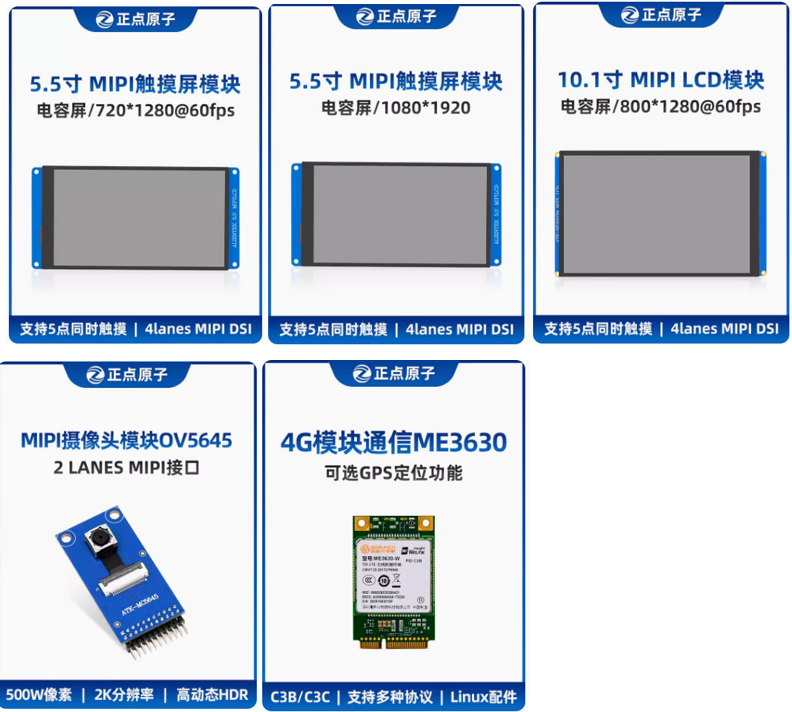

&emsp;&emsp;ATK-DLIMX93开发板可以使用正点原子的OV5645摄像头和屏幕模块等，展现更强的性能效果。目前开发板已经适配的模块如下：

&emsp;&emsp;上述模块均可在正点原子旗舰店进行采购。	

&emsp;&emsp;另外开发板还适配了正点原子10.1寸1280x800 LVDS屏幕，广和通5G RedCap FG132模组，移远4G EC20模组等，用户可以按项目需求进行开发使用。

