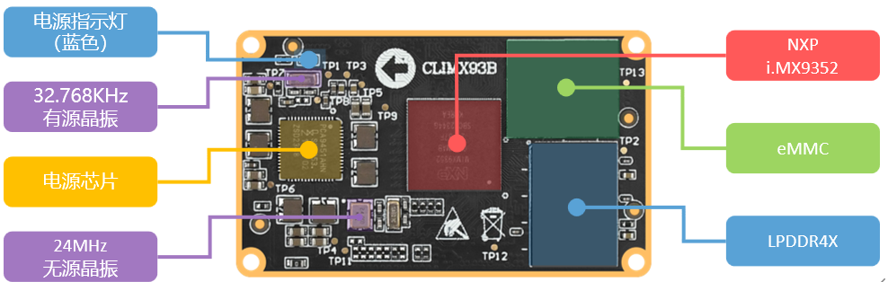

# 1.1 ATK-DLIMX93开发板底板资源

## 1.1.1 ATK-DLIMX93开发板底板资源

&emsp;&emsp;首先，我们来看一下ATK-DLIMX93开发板的底板资源图，如下图所示：

 
图1.1.1.1 ATK-DLIMX93开发板底板资源图

&emsp;&emsp;从上图可以看出，ATK-DLIMX93开发板底板资源十分丰富，扩充了丰富的接口和功能模块。开发板的外形尺寸为170mm*110mm大小，板子的设计充分考虑了人性化设计，便于开发使用。

&emsp;&emsp;正点原子ATK-DLIMX93开发板底板板载资源如下： 
&emsp;&emsp;◆	1组核心板连接座接口，支持ATK-CLIMX93B核心板 
&emsp;&emsp;◆	1个蓝色电源指示灯 
&emsp;&emsp;◆	1个红色状态指示灯 
&emsp;&emsp;◆	1个NOR FLASH芯片，16MB 
&emsp;&emsp;◆	1个EEPROM芯片，8KB 
&emsp;&emsp;◆	1个RTC时钟芯片 
&emsp;&emsp;◆	1个高性能音频编解码芯片，ES8388 
&emsp;&emsp;◆	1路耳机接口，支持4段式耳机 
&emsp;&emsp;◆	2路扬声器外接接口 
&emsp;&emsp;◆	1个驻极体麦克风MIC 
&emsp;&emsp;◆	1个小扬声器（板卡背面） 
&emsp;&emsp;◆	1路WIFI&BT天线接口 
&emsp;&emsp;◆	1个SDIO WIFI&BT模块 
&emsp;&emsp;◆	2路CAN-FD隔离接口 
&emsp;&emsp;◆	2路RS485隔离接口 
&emsp;&emsp;◆	1路USB_TTL调试串口，Type-C接口类型 
&emsp;&emsp;◆	1路USB_OTG接口，Type-C接口类型 
&emsp;&emsp;◆	3路USB2.0 HOST接口  
&emsp;&emsp;◆	1路Mini PCIE 4G/5G模块接口 
&emsp;&emsp;◆	1路Nano SIM卡接口 
&emsp;&emsp;◆	1个可调电位器，用于ADC测试 
&emsp;&emsp;◆	1路ADC连接接口 
&emsp;&emsp;◆	1个RTC纽扣电池座，带电池 
&emsp;&emsp;◆	1路MIPI-CSI摄像头接口 
&emsp;&emsp;◆	1路MIPI-DSI屏幕接口 
&emsp;&emsp;◆	1路LVDS屏幕接口 
&emsp;&emsp;◆	1个启动模式拨码开关 
&emsp;&emsp;◆	1个JTAG&蓝牙串口切换开关 
&emsp;&emsp;◆	1路JTAG调试接口 
&emsp;&emsp;◆	2路10M/100M/1000M以太网接口（RJ45） 
&emsp;&emsp;◆	1路TF卡接口 
&emsp;&emsp;◆	1路DC12V电源输入接口（建议输入电压范围：DC6~16V） 
&emsp;&emsp;◆	1个电源开关，控制整板电源 
&emsp;&emsp;◆	1组5V电源输出口 
&emsp;&emsp;◆	1组3.3V电源输出口 
&emsp;&emsp;◆	1个复位按键 
&emsp;&emsp;◆	1个开关机按键 
&emsp;&emsp;◆	1个用户按键 
&emsp;&emsp;◆	1组2×8P 2.54mm间距的排针，引出16个IO 
&emsp;&emsp;◆	1组2×7P 2.54mm间距的排针，引出14个IO

&emsp;&emsp;正点原子ATK-DLIMX93开发板底板的特点包括： 
&emsp;&emsp;1)、接口丰富。开发板提供十来种标准接口，可以方便地进行各种外设的实验和开发。 
&emsp;&emsp;2)、设计灵活。采用核心板+底板形式，板上很多资源都可以灵活配置，以满足不同条件下的使用。核心板引出了i.MX93所有通信接口，包含UART、I2C、SPI、CANFD、SDMMC、USB2.0、MIPI-DSI、MIPI-CSI、LVDS、ADC、千兆以太网等，极大地方便大家扩展及使用。  
&emsp;&emsp;3)、资源丰富。板载高性能音频编解码芯片、千兆网卡、EEPROM存储芯片以及各种接口芯片，满足多种应用需求。 
&emsp;&emsp;4)、人性化设计。各个接口都有丝印标注，使用起来一目了然；部分常用外设大丝印标出，方便查找；接口位置设计合理，方便使用。 

## 1.1.2 ATK-CLIMX93B核心板资源

&emsp;&emsp;下面我们来看ATK-CLIMX93B核心板，如下图所示：

 
图1.1.2.1 ATK-CLIMX93B核心板

&emsp;&emsp;整个核心板的外形尺寸为50mm*30mm大小，非常小巧，采用了0.4mm间距贴片板对板连接器，和底板BTB连接座的合高为1.5mm，可以很方便地应用在各种项目上。

&emsp;&emsp;正点原子ATK-CLIMX93B核心板板载资源如下： 
&emsp;&emsp;◆	CPU：MIMX9352CVVXMAB，双核Cortex-A55(主频1.7GHz)，单核Cortex-M33（250MHz），FCBGA306封装，11x11mm。 
&emsp;&emsp;◆	内存LPDDR4：容量为1GB。 
&emsp;&emsp;◆	存储EMMC：容量为16GB。 
&emsp;&emsp;◆	高稳定性电源管理PMIC。 
&emsp;&emsp;◆	两个2*50的BTB连接座公座，共计200PIN。

&emsp;&emsp;正点原子ATK-CLIMX93B核心板的特点包括： 
&emsp;&emsp;1)、体积小巧。核心板仅50mm*30mm大小，方便使用到各种项目。 
&emsp;&emsp;2)、集成方便。核心板使用2个2*50P BTB连接座，可以非常方便地集成到客户PCB上，更换简单，方便维修测试。 
&emsp;&emsp;3)、资源丰富。核心板板载1GB LPDDR4内存、16GB EMMC存储器，可以满足多种应用需求。 
&emsp;&emsp;4)、性能稳定。核心板采用8层板设计，单独地层、电源层，且所有关键信号采用等长线走线，保证运行稳定、可靠。 
&emsp;&emsp;5)、人性化设计。按功能分区引出IO口，方便布线。

