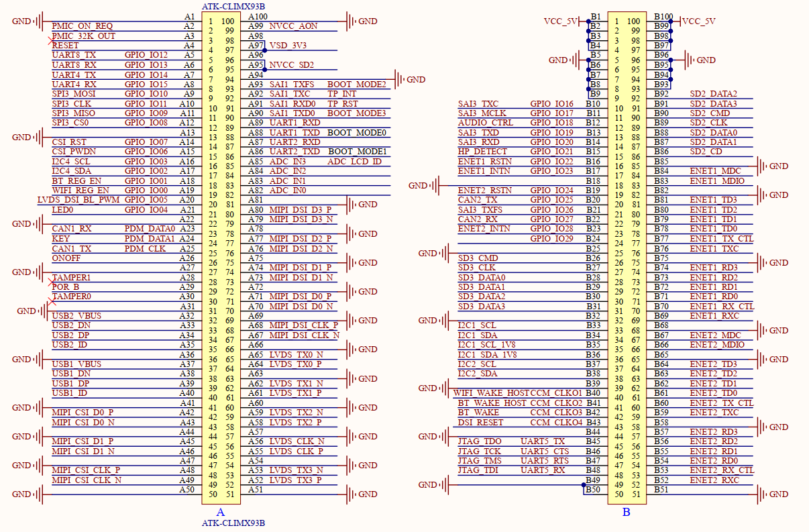
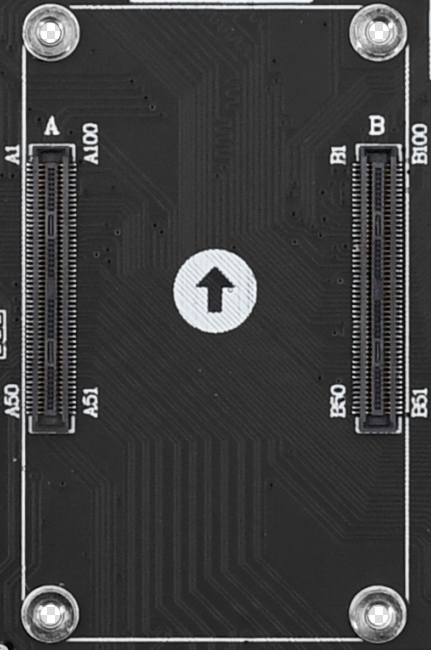

# 3.1 核心板接口

&emsp;&emsp;开发板采用底板+核心板的形式。开发板底板采用2个2*50的（）母座板对板连接器来与核心板连接，接插非常方便，底板上面的核心板接口定义如下图所示：

 
图1.3.1.1 底板对接核心板连接座定义（需更新，A87引脚标错文本BOOT_MODE0）

&emsp;&emsp;图中的A和B就是底板上的连接座接口，由2个2*50PIN的板对板母座组成，包含137个GPIO、4个其他功能引脚、46个GND引脚和13个电源引脚，组成200PIN。

 
图1.3.1.2 底板转接板接口实物图（换高清图）

&emsp;&emsp;用户在设计底板时，需注意连接座的定义顺序，不要接反了方向。比如，原理图图中B1~B4和B97~B100引脚是8个VCC_5V电源输入引脚，供电核心板；B5~B9和B93~B96是9个GND引脚，其他引脚类推。底板具有防反插设计，用户在插拔核心板时，需注意底板图中箭头标记方向与核心板的箭头标记方向保持一致，才能对插成功。

