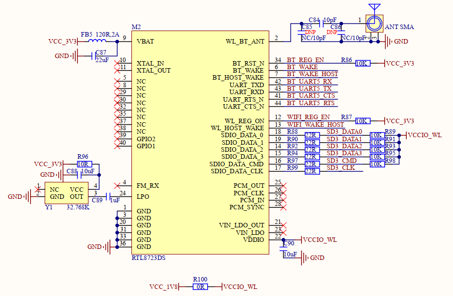
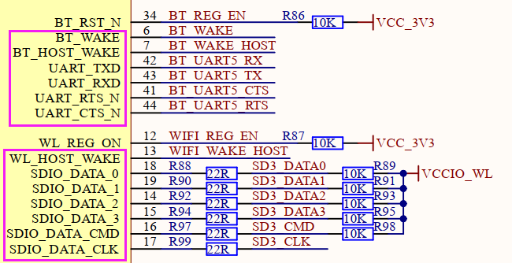

# 1.3.10 SDIO WIFI&蓝牙模块

&emsp;&emsp;开发板板载一个SDIO WIFI&蓝牙模块，原理图如下图所示：

 
图1.3.10.1 SDIO WIFI&蓝牙模块

&emsp;&emsp;开发板WIFI&蓝牙模块采用瑞昱RTL8723DS方案，这是一个SDIO接口的WIFI4和蓝牙4.2模块，无线频段2.4GHz，连接到处理器i.MX93的SD3接口上。

&emsp;&emsp;蓝牙功能是通过UART5串口进行数据收发，该串口与JTAG接口引脚共用，故当用户需要使用蓝牙功能时，需要将开发板板载SW2拨码开关全部拨到ON，来连通到该模组的BT_UART5串口信号线。

&emsp;&emsp;需注意一点，由于处理器i.MX93的SD3总线IO电平为1.8V，故本模块的IO电源需要配置为1.8V供电，即模块第22号引脚VDDIO为1.8V供电。

&emsp;&emsp;根据RTL8723DS数据手册可查知，本模块的以下引脚需要使用1.8V电源域IO：BT_WAKE、BT_HOST_WAKE、UART_TXD、UART_RXD、UART_RTS_N、UART_CTS_N、WL_HOST_WAKE、SDIO_DATA_0、SDIO_DATA_1、SDIO_DATA_2、SDIO_DATA_3、SDIO_DATA_CMD、SDIO_DATA_CLK。用户设计底板时如果部分引脚选用3.3V IO，则需要进行电平转换。

 
图1.3.10.2 1.8V电源域IO

