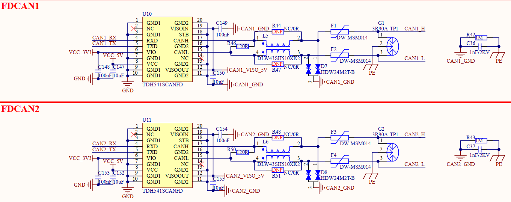

# 1.3.11 FDCAN接口

&emsp;&emsp;开发板板载2路FDCAN接口电路，原理图如下图所示：

 
图1.3.11.1 FDCAN接口电路

&emsp;&emsp;开发板采用隔离式CAN收发器TDH541SCANFD进行CAN接口设计，支持CAN和CANFD协议，通讯速率高达5Mbps。金升阳TDH541SCANFD收发器自身集成电源隔离和数字隔离，同时具有短路保护、过温保护等特性，能够保护开发板内部不被外部恶劣工作环境损害。

&emsp;&emsp;本电路对CAN信号端口添加多重防护器件，极大保护模块不被损坏及确保总线通讯的可靠性。用户在使用屏蔽线时需要对屏蔽层可靠单点接地。

