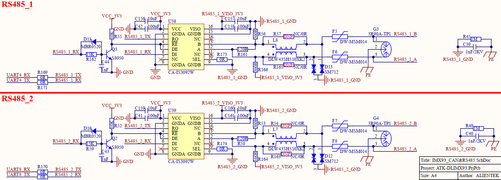

# 1.3.12 RS485接口

&emsp;&emsp;开发板板载2路RS485接口电路，原理图如下图所示：

 
图1.3.12.1 RS485接口

&emsp;&emsp;开发板采用隔离式半双工RS485收发器CA-IS3092W进行RS485接口设计。开发板选用川土微CA-IS3092W收发器通讯数据速率为0.5Mbps，自身集成电源隔离和数字隔离，同时具有短路保护、热关断保护等特性，能够保护开发板内部不被外部恶劣工作环境损害。

&emsp;&emsp;本电路对RS485信号端口添加多重防护器件，极大保护模块不被损坏及确保总线通讯的可靠性。用户在使用屏蔽线时需要对屏蔽层可靠单点接地。

&emsp;&emsp;CA-IS3092W收发器的RE和DE引脚通过功能电路连接到了UARTx_TX引脚上，这样就可以通过UARTx_TX引脚来自动控制RS485收发器的接收和发送状态，完全将RS485当做一个串口来使用。

