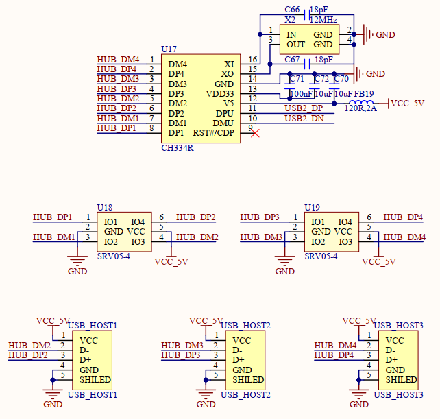

# 1.3.13 USB HUB接口

&emsp;&emsp;开发板板载一颗一扩四的USB HUB芯片，用于将处理器i.MX93的USB2扩展为4路USB HOST接口(其中1路连接4G模块，剩余3路可以外接其他USB设备)，原理图如下图所示：

 
图1.3.13.1 USB HUB接口

&emsp;&emsp;处理器i.MX93带有两个USB接口，但是对于Linux应用来说两个USB太少了，如果我们要连接鼠标、键盘、U盘等设备，那么两个USB口完全不够用。因此开发板通过CH334R芯片将i.MX93的USB2外扩出4路USB HOST接口，其中一路外接了4G模块，因此提供给用户的有3路USB HOST接口。
