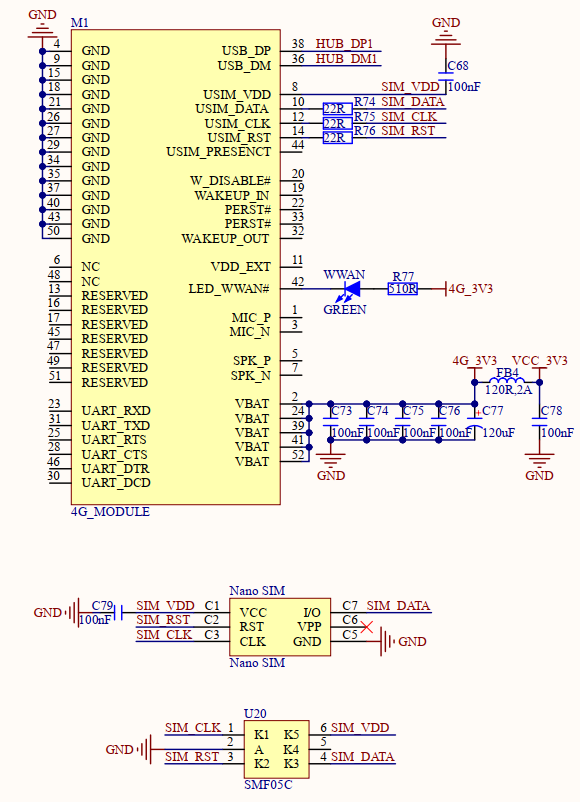

# 1.3.14 4G模块接口

&emsp;&emsp;开发板板载一个4G Mini PCIE接口，原理图如下图所示：

 
图1.3.14.1 4G模块

&emsp;&emsp;M1就是Mini PCIE接口的4G模块连接座，用于连接Mini PCIE接口的4G模块，比如移远EC20模块。Nano SIM卡座用于插入Nano SIM卡，搭配4G模块一起使用。4G模块虽然采用Mini PCIE接口，但是实际走的USB接口，这里是连接到了CH334R扩展出来的一个USB HOST接口上。

