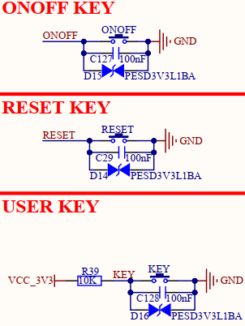

# 1.3.15 按键（复位、开关机、用户）

&emsp;&emsp;开发板板载3个机械按键，原理图如下图所示：

 
图1.3.15.1 输入按键

&emsp;&emsp;各个按键功能如下：

&emsp;&emsp;1、ONOFF按键为处理器i.MX93的开关机按键，长按ONOFF按键5秒，处理器进入关机状态；短按ONOFF按键0.5秒，处理器进入开机状态；

&emsp;&emsp;这里再说明一下，当处理器通过长按ONOFF按键进入关机状态后，处理器会将PMIC_ON_REQ引脚拉低至0V，若底板DCDC电源芯片的EN引脚是使用PMIC_ON_REQ引脚使能，则此时该DCDC电源会失能断电。

&emsp;&emsp;2、RESET复位按键用于复位核心板，RESET信号引脚连接到了核心板PMIC电源管理芯片的PMIC_RST_B控制引脚，用于给PMIC重新上电，进而让处理器、LPDDR4X、EMMC等核心板器件重新上电。复位电平为低电平有效。

&emsp;&emsp;3、KEY按键是普通输入按键，提供给用户进行按键输入测试。

