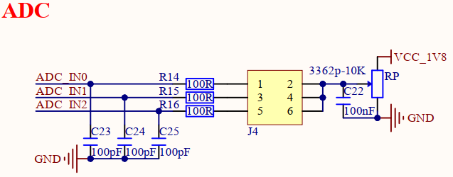

# 1.3.16 可调电位器

&emsp;&emsp;开发板板载一个可调电位器，用来完成ADC电压采集，原理图如下图所示：

 
图1.3.16.1 可调电位器

&emsp;&emsp;处理器i.MX93有4个ADC专用引脚，它们的IO电源域是1.8V，分为ADC_IN0~ADC_IN3。图中RP是一个阻值为10K的可调电位器，上拉到1.8V电源，通过J4排针座将可调电阻器连接到ADC_IN0、ADC_IN1和ADC_IN2这三路ADC通道，即这三个ADC引脚都可以采集同一个可调电位器电压，还有一路ADC_IN3通道，用于开发板MIPI-DSI屏幕的ID识别，通过采集不同电压值，来区分不同分辨率的LCD屏幕。

