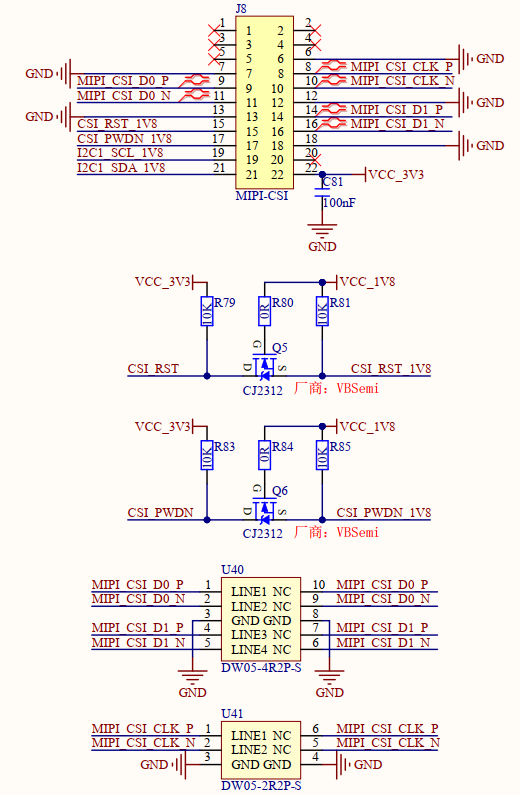

# 1.3.17 MIPI-CSI摄像头接口 

&emsp;&emsp;开发板板载一个MIPI-CSI摄像头接口，支持MIPI CSI的摄像头模块，原理图如下图所示：

 
图1.3.17.1 MIPI-CSI摄像头接口

&emsp;&emsp;处理器i.MX93支持2-lane MIPI CSI-2摄像头输入信号，包含2对RX数据线和1对RX时钟线，在高速模式下每对数据线支持数据速率80Mbps–1.5Gbps，低功耗模式支持10 Mbps。

&emsp;&emsp;此接口已适配支持正点原子ATK-MC5645摄像头模块（OV5645），其中CSI_RST、CSI_PWDN、I2C1_SCL和I2C1_SDA四根信号引脚均为1.8V IO，如果用户设计底板选用3.3V IO，则需要进行电平转换。

