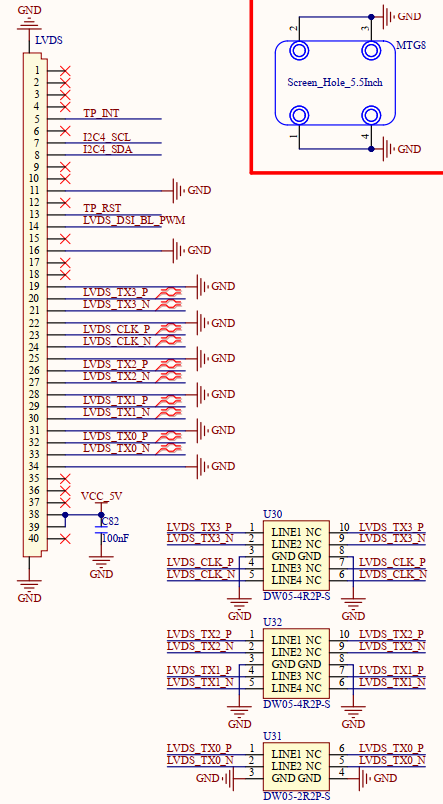

# 1.3.18 LVDS屏幕接口

&emsp;&emsp;1.3.18 LVDS屏幕接口

 
图1.3.18.1 LVDS屏幕接口

&emsp;&emsp;处理器i.MX93支持4-lane LVDS屏幕显示，支持分辨率为1366x768 P60或1280x800 P60。

&emsp;&emsp;该接口已适配一款正点原子10.1寸1280*800 LVDS LCD电容触摸屏，支持I2C接口触摸。图中TP_INT引脚为屏幕触摸芯片的中断引脚，TP_RST引脚为屏幕触摸芯片的上电复位使能引脚，I2C4_SCL和I2C4_SDA为屏幕触摸芯片的I2C通信接口，用于驱动程序配置触摸芯片，LVDS_DSI_BL_PWM引脚为屏幕的背光引脚，支持PWM调光。

