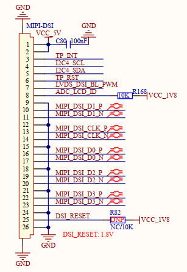

# 1.3.19 MIPI-DSI屏幕接口

&emsp;&emsp;开发板支持MIPI-DSI接口屏幕，原理图如下图所示：

 
图1.3.19.1 MIPI-DSI屏幕接口

&emsp;&emsp;处理器i.MX93支持4-lane MIPI DSI屏幕显示，支持最高分辨率为1920x1200 P60。

&emsp;&emsp;处理器i.MX93只有一个LCDIF显示控制器，不支持LVDS和MIPI DSI接口同时使用，即不支持同显、异显操作，同一时刻只能单独使用。

&emsp;&emsp;该接口已适配正点原子5.5寸720*1280、5.5寸1080*1920、10.1寸800*1280 MIPI LCD电容触摸屏，支持I2C接口触摸。

&emsp;&emsp;图中TP_INT引脚为屏幕触摸芯片的中断引脚，TP_RST引脚为屏幕触摸芯片的上电复位使能引脚，ADC_LCD_ID引脚为ADC采集电压引脚来识别屏幕ID，I2C4_SCL和I2C4_SDA为屏幕触摸芯片的I2C通信接口，用于配置触摸芯片，LVDS_DSI_BL_PWM引脚为屏幕的背光引脚，支持PWM调光。

&emsp;&emsp;由于此接口需要适配正点原子不同分辨率的MIPI屏幕，故本电路使用ADC_LCD_ID引脚进行ADC电压采集，通过屏幕自身不同分压电阻配置情况，来区分不同分辨率的屏幕，以此实现屏幕ID识别功能。（用户可查阅正点原子不同分辨率的MIPI屏幕原理图，以此了解）

&emsp;&emsp;需注意此引脚在开发板接口处默认上拉10K电阻（精度1%）至1.8V，当开发板不接任何屏幕时，此ADC引脚电压采样值默认为1.8V左右。

&emsp;&emsp;此设计会与正点原子MIPI屏幕自身的分压电阻形成并联，进而影响屏幕ID设计电平，故屏幕ID电平的实际ADC电压采样值以本电路设计为准。用户设计底板时，建议参考本电路设计。

