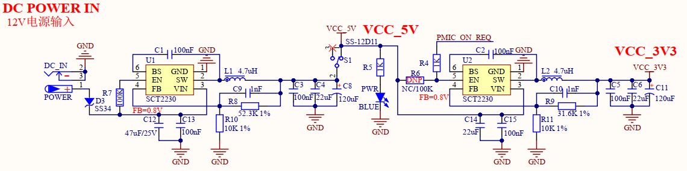
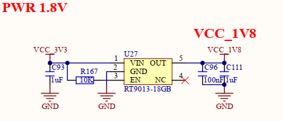

# 1.3.2 直流电源供电

&emsp;&emsp;开发板板载电源供电部分，原理图如下图所示：。

 
图1.3.2.1 DC_IN电源供电

 
图1.3.2.2 1.8V电源供电

&emsp;&emsp;开发板所有功能电路需要进行5V、3.3V及1.8V电源供电。图中共有2个DCDC电源芯片，即U1和U2。DC_IN插座用于外部DC12V直流电源输入，D3是防反接二极管，避免外部直流电源极性搞错时烧坏开发板。

&emsp;&emsp;直流电源经过U1 DCDC芯片转换为5V电源输出，给核心板及其他电路供电。S1为开发板的总电源开关。当5V供电正常时，开发板的蓝色电源指示灯会亮起。U2为输出3.3V DCDC芯片，给开发板提供3.3V电源。

&emsp;&emsp;U2的EN控制引脚由核心板PMIC_ON_REQ引脚进行使能控制，该引脚在核心板上默认下拉100K电阻。核心板处理器正常上电后，PMIC_ON_REQ引脚会自动拉高为1.8V（不是3.3V），从而使能底板U2电源输出。

&emsp;&emsp;如果用户对处理器i.MX93进行关机操作，比如长按按键ONOFF 5秒后，处理器进入关机状态，则PMIC_ON_REQ引脚会被自动拉低至0V，此时U2电源将被断电。

&emsp;&emsp;U27为输出1.8V电源的LDO芯片，用于给ADC、WIFI等一些需要1.8V电源的外设进行供电使用。

