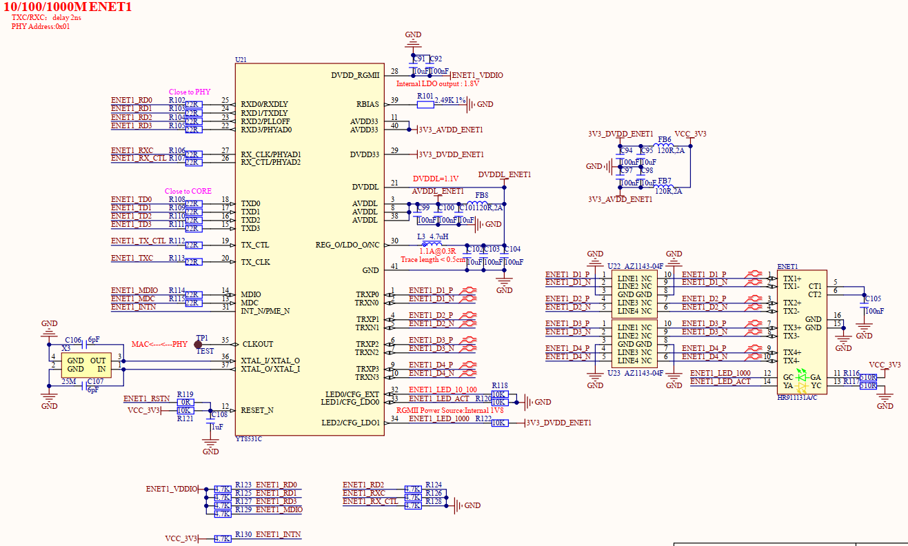

# 1.3.20 千兆以太网接口（RJ45）

&emsp;&emsp;开发板板载2路千兆以太网接口(RJ45)，原理图如下图所示：

 
图1.3.20.1 千兆以太网接口

&emsp;&emsp;处理器i.MX93内部自带2个千兆网络MAC控制器，因此可以提供2个千兆以太网接口。

&emsp;&emsp;此处示例为ENET1网络1原理图，ENET2网络2同理，注意区分网络地址，网络1地址为1，网络2地址为2。

&emsp;&emsp;由于处理器i.MX93的网络通信TX\RX相关引脚IO电源域为1.8V，故本电路配置PHY芯片RGMII电压为PHY内置LDO输出1.8V，如图中ENET1_VDDIO电源电压为1.8V。

&emsp;&emsp;开发板选用千兆网络PHY芯片型号为裕太微电子YT8531C，支持10/100/1000Mbps速率自适应；RJ45连接器选用型号为HR911131A，内置网络变压器，自带有2个指示灯，按常用规则设计，橙黄色指示灯闪烁表示正进行网络数据传输，绿色指示灯常亮表示网络连接正常。此处建议采用四层线路板设计千兆网络，否则二层线路板未能保持完整参考平面，可能导致网速未能达到近千兆速率。

