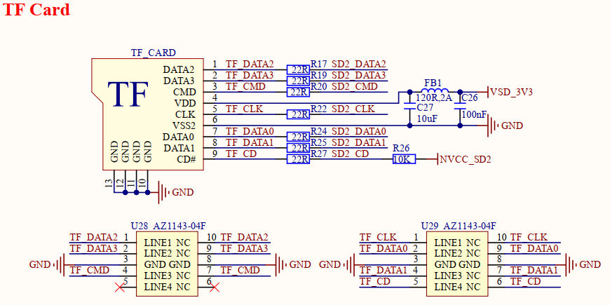

# 1.3.21 TF卡接口

&emsp;&emsp;开发板板载一个TF卡接口，原理图如下图所示：

 
图1.3.21.1 TF卡接口 

&emsp;&emsp;处理器i.MX93支持3路SD接口，SD3.0协议，分别为SD1、SD2和SD3。其中SD1接口用于核心板EMMC存储芯片，SD2用于此TF卡接口，SD3用于开发板SDIO WIFI模块。

&emsp;&emsp;由于不同类型TF卡可使用1.8V或3.3V两种IO电平进行通信，而1.8V IO电平能够支持更高速率，故本电路兼容支持这两种IO电平自动切换。

&emsp;&emsp;图中TF_CARD为TF卡卡座接口，采用4线数据线方式驱动，非常适合需要高速存储的情况。SD2_CD为热插拔检测引脚，电源VSD_3V3由核心板板载PMIC电源管理芯片固定提供3.3V供电，而SD2信号线和NVCC_SD2电源电平将由用户所插入TF卡类型决定。

&emsp;&emsp;当用户插入高速TF卡，若TF卡本身支持工作电压1.8V，则SD2信号线和NVCC_SD2电源电平会切换为1.8V，否则为3.3V。

&emsp;&emsp;该TF卡电平切换是由处理器i.MX93的SD2接口和核心板PMIC电源芯片共同完成，故用户设计底板TF卡电路时务必使用SD2接口。

