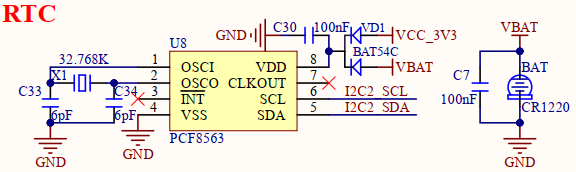

# 1.3.22 RTC实时时钟

&emsp;&emsp;开发板板载一个RTC实时时钟芯片，原理图如下图所示：

 
图1.3.22.1 RTC电路

&emsp;&emsp;处理器i.MX93具有内部RTC外设，电源域为1.8V，由核心板板载PMIC电源管理芯片进行供电，核心板并没有将此内部RTC电源域供电引脚引出到底板。若用户需要在整机断电情况下，还需要使用RTC计时功能，则需要使用外部RTC芯片进行计时。

&emsp;&emsp;本电路选用PCF8563 RTC芯片进行设计，可兼容替换为武汉芯景RTC芯片AT8563等。

&emsp;&emsp;该RTC芯片VDD电源采用纽扣电池CR1220和板载3.3V混合供电的方式，在有板载电源3.3V供电时，纽扣电池CR1220不向RTC芯片供电；当板载电源3.3V断电时，则由纽扣电池CR1220给RTC芯片供电3V。这样，芯片VDD总是有电的，以保证RTC计时。用户若需要严格计时准确，则建议使用特性更好的晶振提供精确时钟。

