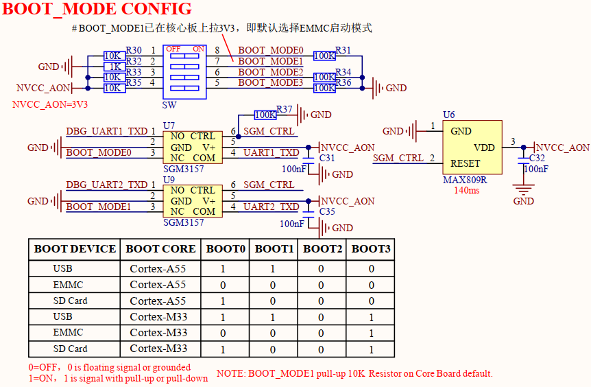

# 1.3.4 启动模式设置接口

&emsp;&emsp;ATK-DLIMX93开发板的BOOT启动模式设置接口电路，原理图如下图所示：

 
图1.3.4.1 启动模式设置接口

&emsp;&emsp;开发板支持从多种不同的设备启动，通过设置拨码开关可以选择从指定的设备启动。核心板默认选择A55核EMMC启动模式，故底板支持的模式为以下配置：

启动模式设置表1.3.4.1 

<table class="climx93b_center-table">
  <tr>
    <th>BOOT0</th>
    <th>BOOT1</th>
    <th>BOOT2</th>
    <th>BOOT3</th>
    <th>启动核</th>
    <th>启动模式</th>
  </tr>
  <tr>
    <td>1</td>
    <td>1</td>
    <td>0</td>
    <td>0</td>
    <td>Cortex-A55</td>
    <td>USB启动</td>
  </tr>
  <tr>
    <td>0</td>
    <td>0</td>
    <td>0</td>
    <td>0</td>
    <td>Cortex-A55</td>
    <td>EMMC启动</td>
  </tr>
  <tr>
    <td>1</td>
    <td>0</td>
    <td>0</td>
    <td>0</td>
    <td>Cortex-A55</td>
    <td>SD Card启动</td>
  </tr>
  <tr>
    <td>1</td>
    <td>1</td>
    <td>0</td>
    <td>1</td>
    <td>Cortex-M33</td>
    <td>USB启动</td>
  </tr>
  <tr>
    <td>0</td>
    <td>0</td>
    <td>0</td>
    <td>1</td>
    <td>Cortex-M33</td>
    <td>EMMC启动</td>
  </tr>
  <tr>
    <td>1</td>
    <td>0</td>
    <td>0</td>
    <td>1</td>
    <td>Cortex-M33</td>
    <td>SD Card启动</td>
  </tr>
</table>

&emsp;&emsp;处理器i.MX93由4个引脚负责启动模式的配置：UART1_TXD（**BOOT_MODE0**）、UART2_TXD（**BOOT_MODE1**）、SAI1_TXFS（**BOOT_MODE2**）、SAI1_TXD0（**BOOT_MODE3**）。由于引脚UART1_TXD和UART2_TXD涉及到系统调试串口和启动模式两种功能，两者相冲突，故本电路采用模拟开关SGM3157和复位芯片MAX809R进行分时复用设计。核心板正常上电后，NVCC_AON电源会输出3.3V供电给SGM3157和MAX809R。MAX809R的RESET引脚此时会在至少140ms延迟后才会输出高电平（默认为低电平），进而控制模拟开关SGM3157的连接通道。此特性能让SGM3157模拟开关在上电初始时UART1_TXD连通BOOT_MODE0，UART2_TXD连通BOOT_MODE1，实现启动模式的设置；140ms后会自动切换连通到各自调试串口引脚DBG_UART1_TXD和DBG_UART2_TXD，从而实现启动模式和调试串口互不影响各自功能。

