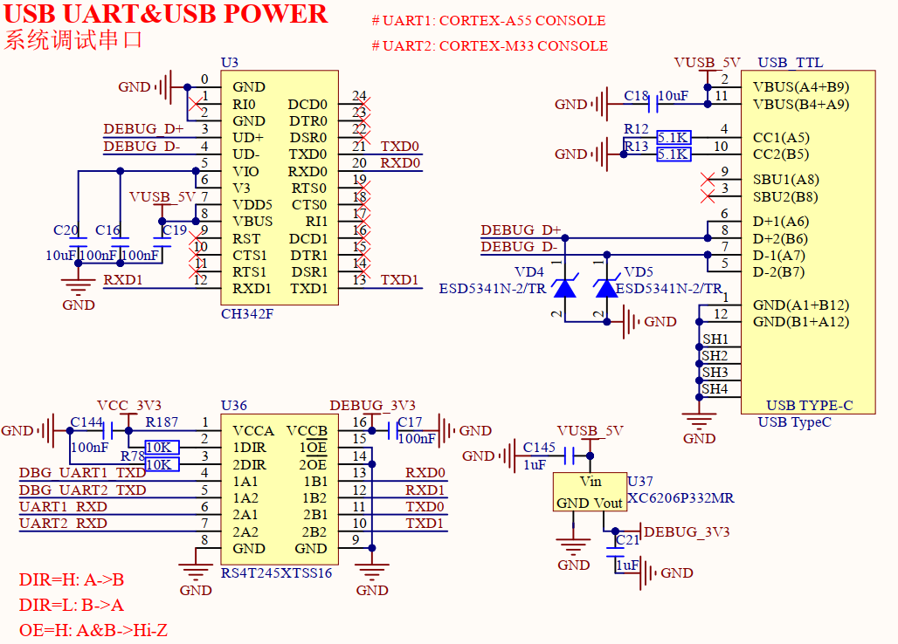

# 1.3.5 USB_TTL调试串口（系统调试）

&emsp;&emsp;开发板板载一个USB_TTL调试串口，Type-C接口类型，原理图如下图所示：

 
图1.3.5.1 USB_TTL调试串口

&emsp;&emsp;由于处理器i.MX93为多核异核处理器，包含双核Cortex-A55和单核Cortex-M33，两者均可独立运行，故系统调试串口有2个，为UART1（调试A55核）和UART2（调试M33核）。开发板采用一路USB转两路TTL串口方案，选择沁恒CH342F芯片实现通信接口转换。图中U3为CH342F芯片，通过USB线进行独立供电，当开发板USB_TTL接口接入USB线时，则可以直接给CH342F芯片供电5V。需注意一点的是，当开发板DC12V电源不供电但仍接着USB线供电CH342F时，CH342F芯片的TX引脚默认高电平会给核心板灌电流，故本电路中采用RS4T245XTSS16电平转换芯片能起隔离作用，防止IO灌电流。U37是一个LDO芯片，使用USB线向RS4T245XTSS16的一侧提供3.3V电源，而转换芯片另一侧由DC12V直流电源转换出3.3V进行供电。
