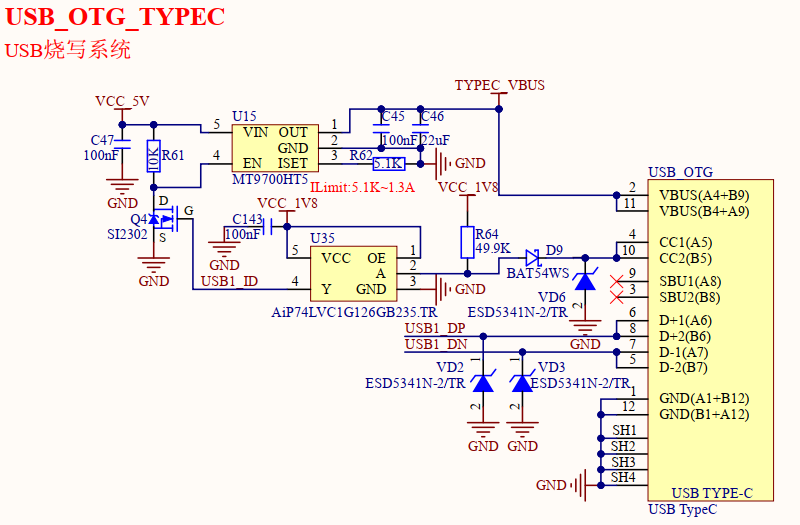
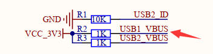

# 1.3.6 USB_OTG接口（系统烧写）

&emsp;&emsp;处理器i.MX93支持从USB启动模式进行系统固件烧写。开发板板载一个USB_OTG接口，既可以烧写系统固件，也可以通过USB OTG线，接入USB HOST设备使用。如下图所示。

 
图1.3.6.1 USB_OTG接口

&emsp;&emsp;USB_OTG电路既可以作为USB从机（DEVICE），也可以作为USB主机（HOST）。图中右侧USB_OTG接口是USB Type-C座，通过此USB Type-C座可以进行系统固件烧写及进行USB OTG测试。如果需要做USB OTG测试，那么还需要购买一根Type-C OTG线。

&emsp;&emsp;图中USB1_ID引脚用于决定处理器i.MX93的USB主从模式，当USB1_ID引脚为高电平时，处理器i.MX93当USB从机；当USB1_ID引脚为低电平时，处理器i.MX93当USB主机。此电路通过USB1总线，默认间接将USB1_ID上拉至1.8V，能让处理器i.MX93进入USB从机模式，用于连接PC电脑进行系统固件烧写。

&emsp;&emsp;为了支持USB主机模式，此处添加缓冲器器件，当USB Type-C座接入外部OTG转接线并接入U盘时，能够拉低USB1_ID引脚电平到0V附近，从而让处理器进入USB主机模式，同时通过MT9700HT5电源芯片对外供电5V。

&emsp;&emsp;如果用户设计底板USB接口不使用USB OTG功能，即只让处理器当USB从机，仅用于烧写系统，那么可以不用加入缓冲器和MT9700HT5电源，USB1_ID直接上拉至1.8V即可，同时USB1_VBUS电源引脚也需要供电3.3V。

 
图1.3.6.2 USB1_VBUS供电

