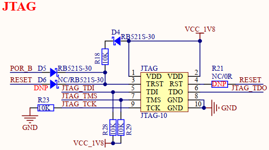
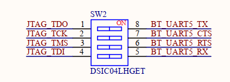

# 1.3.7 JTAG接口

&emsp;&emsp;开发板板载一个10针，2.0mm间距的JTAG接口，原理图如下图所示：

 
图1.3.7.1 JTAG接口

 
图1.3.7.2 JTAG和蓝牙串口切换开关

&emsp;&emsp;该JTAG接口可用于调试Cortex-M33应用程序。用户将启动模式选择Cortex-M33 USB模式启动，即可通过JTAG接口来调试M33核。

&emsp;&emsp;由于处理器i.MX93的JTAG引脚可复用成UART5串口功能（IO电平为1.8V），故开发板采用引脚共用设计，注意两者不能同时使用，需要通过SW2拨码开关进行手动切换。开发板默认将JTAG_TDO、JTAG_TCK、JTAG_TMS、JTAG_TDI四个引脚连接到JTAG座，作M33调试用途。当用户要使用蓝牙功能时，则需要拨动SW2拨码开关将全部引脚连通到BT_UART5，在Cortex-A55运行Linux系统时可用作蓝牙串口功能。
