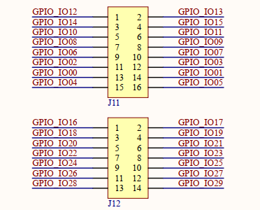

# 1.3.8 引出IO口

&emsp;&emsp;开发板通过2X8P和2X7P两个排针组引出了30个IO口，原理图如下图所示：

 
图1.3.8.1 引出IO口

&emsp;&emsp;根据底板器件布线方便需要，此处分为两个排针组。这些引出IO口均对应处理器i.MX93的GPIO2端口。用户可以使用这些IO连接一些其他模块，进行更多有意思的创新。这里特别提示，该引出IO口并非独立使用，几乎全部与开发板板载功能电路引脚共用。

&emsp;&emsp;故用户在使用这些引出IO时，需要检查底板功能电路对这些IO的硬件配置情况，比如进行了电阻上下拉、并联电容等，如影响使用，则需要手动移除。在单独使用指定IO时，不能和开发板功能有冲突，不能同时使用，需要进行系统复用功能的更改。

